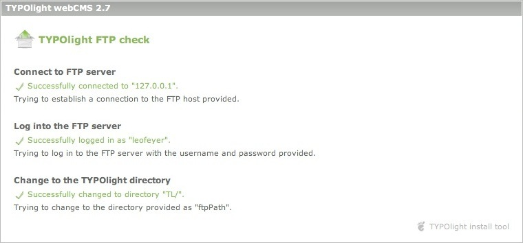

# Installation

Die folgenden Abschnitte erklären die Installation und Aktualisierung von
Contao. Sie lernen wie man das Contao-Installtool verwendet, wie man eine
Installation per FTP synchronisiert, wie man den Safe Mode Hack einrichtet und
wie man einen Webserver für Contao konfiguriert.


## Contao installieren

Laden Sie sich zunächst das [aktuelle Contao-Archiv][1] herunter und entpacken
Sie es auf Ihrem lokalen Rechner. Verschieben Sie die Dateien in das
`htdocs`-Verzeichnis Ihrer XAMPP-Installation oder kopieren Sie sie mit einem
FTP-Programm (z.B. [WinSCP][2]) auf Ihren Server. Der Basisordner heißt
wahrscheinlich `htdocs`, `httpdocs`, `html` oder `public_html`.

Wenn Sie SSH-Zugriff auf den Server haben, können Sie alternativ folgende
Befehle verwenden:

``` {.bash}
curl -L http://install.contao.org | tar -xzp
```

Ihr Contao-Verzeichnis sollte nun wie folgt aussehen:


### Das Contao-Installtool

Um das Contao-Installtool aufzurufen, hängen Sie einfach `/contao/install.php`
an die URL Ihrer Contao-Installation an. Beachten Sie, dass das Installtool mit
einem Passwort gegen Brute Force-Attacken geschützt ist und gesperrt wird, wenn
dreimal hintereinander ein falsches Passwort eingegeben wurde. Um diese Sperre
aufzuheben, öffnen Sie die Datei `system/config/localconfig.php` in einem
Texteditor, finden Sie die folgende Zeile und setzen Sie sie auf `0`.

``` {.php}
$GLOBALS['TL_CONFIG']['installCount'] = 0; // Hebt die automatische Sperre auf
```

Hinweis: Bis einschließlich Version 2.8 lautet der Pfad zum Installtool
`/typolight/install.php` und das Startpasswort "typolight".


#### Encryption-Key erstellen

Der Encryption-Key wird benötigt, um Daten verschlüsselt zu speichern. Einmal
verschlüsselt können die Daten nur noch mit diesem Key wieder entschlüsselt
werden! Notieren Sie ihn sich daher wenn Sie das Feature nutzen
(Verschlüsselung wird momentan im Core nicht verwendet).


#### Datenbankverbindung herstellen

Melden Sie sich an der Administrationsoberfläche Ihres Servers (z.B. "Plesk"
oder "Cpanel") an und erstellen Sie eine neue Datenbank für TYPOlight. Geben
Sie die Zugangsdaten im Contao-Installtool ein und beachten Sie die abweichende
Schreibweise `UTF8` in MySQL!


#### Tabellen aktualisieren

Contao prüft bei der Installation die Tabellen der Datenbank und gibt eine
Liste empfohlener Änderungen aus wenn diese nicht aktuell sind. Lesen Sie diese
Empfehlungen aufmerksam, denn Contao kennt nur seine eigenen Tabellen und wird
versuchen, vermeintlich nicht benötigte Tabellen anderer Programme
"aufzuräumen". Bestätigen Sie die Änderungen durch Anklicken der "Update
database"-Schaltfläche.


#### Template importieren

Ein Template ist eine vorkonfigurierte Webseite, die eine beispielhafte
Seitenstruktur und verschiedene Stylesheets zur Formatierung der Contao
Core-Module und -Inhaltselemente enthält. Das Standardtemplate heißt "Music
Academy". Um es zu importieren, wählen Sie `example_website.sql` aus dem
Drop-Down-Menü und klicken Sie auf die "Import template"-Schaltfläche. Wenn
Sie ein anderes [Frontend-Template][3] erworben haben, wählen Sie stattdessen
die entsprechende SQL-Datei. **Beim Import eines Templates werden bestehende
Daten überschrieben!**


#### Administrator-Konto erstellen

Wenn Sie kein Template importiert haben, müssen Sie ein Administrator-Konto
erstellen, damit Sie sich am Contao-Backend anmelden können. Danach ist der
Installationsprozess abgeschlossen. Der Link unten rechts leitet Sie zur
Backend-Anmeldung weiter. Wenn Sie die Beispielwebseite importiert haben,
können Sie sich als Benutzer "k.jones" mit dem Passwort "kevinjones" anmelden.


### Suchmaschinenfreundliche URLs verwenden

Wenn Sie einen Apache-Webserver haben und mod_rewrite verwenden dürfen, können
Sie Contao dazu veranlassen, suchmaschinenfreundliche URLs zu generieren, die
wie statische HTML-Seiten aussehen. Die dazu benötigten Rewrite-Regeln sind in
der `.htaccess.default`-Datei im Contao-Verzeichnis gespeichert. Benennen Sie
diese Datei um in `.htaccess`, damit sie vom Apache-Server erkannt wird, und
rufen Sie anschließend das Modul "Einstellungen" im Contao-Backend auf. Wählen
Sie die Option "URLs umschreiben" in der Gruppe "Frontend-Einstellungen" aus und
speichern Sie Ihre Änderungen. Contao generiert jetzt statische URLs wie z.B.
`home.html` anstatt `index.php?id=12`.


## Den Safe Mode Hack verwenden

Eventuell haben Sie beim Aufruf des Contao-Installtools die Mitteilung erhalten,
dass die lokale Konfigurationsdatei nicht beschreibbar ist.


### Dateizugriffsrechte

Die Bezeichnung "Safe Mode Hack" ist eigentlich nicht korrekt, da sie
impliziert, dass das Problem durch den PHP safe_mode verursacht würde.
Tatsächlich wird es jedoch von unzureichenden Dateizugriffsrechten verursacht
und tritt auch bei deaktiviertem safe_mode auf, daher sollte es richtiger "File
Permission Hack" heißen. PHP als Apache-Modul läuft normalerweise als Benutzer
`wwwrun`, `www-data` oder `nobody`, wohingegen die Dateien, die Sie per FTP
hochgeladen haben, Ihrem Benutzer (z.B. `web4` oder `ab5678`) gehören. Der
Server verweigert Benutzern grundsätzlich den Zugriff auf fremde Dateien und
macht auch für das PHP-Skript Contao keine Ausnahme.


#### FTP für Dateioperationen verwenden

Um das Rechteproblem zu umgehen, baut Contao eine FTP-Verbindung auf und legt
die Ressourcen unter dem FTP-Benutzer an. Sie müssen dafür nur Ihre
FTP-Zugangsdaten in der lokalen Konfigurationsdatei
(system/config/localconfig.php) eintragen.

``` {.php}
$GLOBALS['TL_CONFIG']['useFTP']  = true;
$GLOBALS['TL_CONFIG']['ftpHost'] = 'domain.com';
$GLOBALS['TL_CONFIG']['ftpPath'] = 'httpdocs/';
$GLOBALS['TL_CONFIG']['ftpUser'] = 'ab5678';
$GLOBALS['TL_CONFIG']['ftpPass'] = '********';
```

Ersetzen Sie die obigen Login-Daten mit Ihren eigenen und achten Sie besonders
darauf, den korrekten "ftpPath" einzugeben. Es handelt sich dabei um den
relativen Pfad vom FTP-Basisordner zum Contao-Verzeichnis (z.B. `html/`,
`public_html/` oder `httpdocs/`).


#### Schreibrechte zuweisen

Die Third-Party-Plugins, die in Contao verwendet werden, kennen den Safe Mode
Hack natürlich nicht und benötigen daher Schreibrechte für bestimmte
Verzeichnisse. Verwenden Sie Ihr FTP-Programm oder SSH-Terminal, um die
nachfolgend genannten Ordner beschreibbar zu machen (CHMOD 777). Unabhängig
davon, was Sie eventuell in einem Tutorial oder im Contao-Forum gelesen haben,
müssen und sollten nur diese drei Verzeichnisse angepasst werden, um den Safe
Mode Hack zu nutzen!

* `system/html`
* `system/logs`
* `system/tmp`

Ab Version 2.7.3 werden die benötigten Schreibrechte automatisch gesetzt.


#### Die FTP-Verbindung prüfen

Um zu prüfen, ob der richtige "ftpPath" gesetzt ist, klicken Sie auf die "Check
FTP connection"-Schaltfläche.




[1]: https://contao.org/de/download.html
[2]: http://www.winscp.com
[3]: https://contao.org/de/contao-themes-and-templates.html
