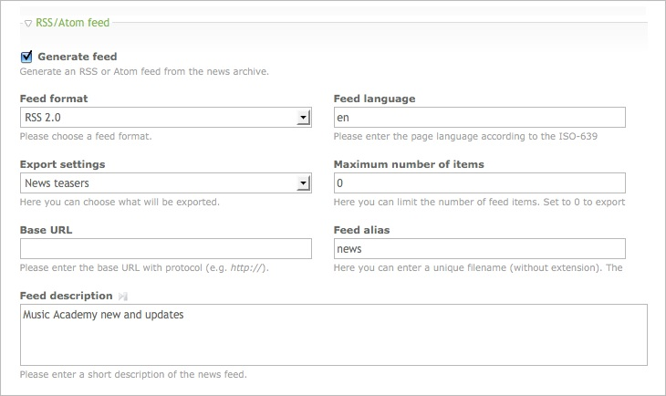
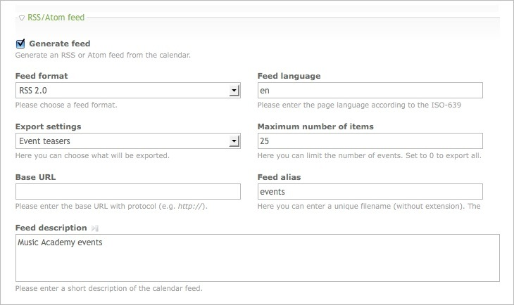
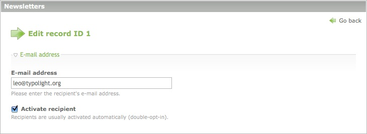
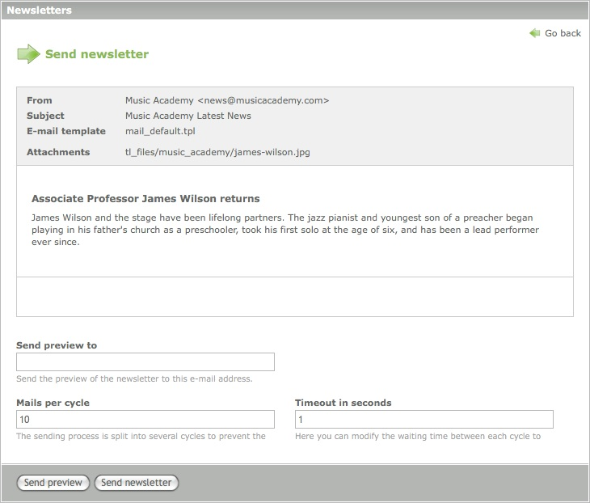

# Managing content

The following chapters explain how to manage content in Contao. The Contao core
supports many different content types like articles, news, events, newsletters,
forms or definitions. Further content types like banners, tickets, products or
recommendations are available in the Extension Repository. To create content,
log into the back end and choose one of the modules in the Content section of
the navigation menu.


## Articles

Articles are containers for content elements. Grouping content elements that
belong together makes it easy to move, publish, copy, edit or export them all at
once instead of one by one. Each article is associated with a particular page
and layout section and therefore has a fixed position in the site structure and
on the website. Contao optionally shows only the article teaser with a "Read
more" link.


### Content elements

Content elements are an easy and intuitive way to create content. Instead of
just using a Rich Text Editor, Contao provides a separate element for each type
of content like texts, lists, tables, hyperlinks, images or downloads. Here is
an overview of the Contao core content elements:

<table>
<tr>
  <th>Name</th>
  <th>CSS class</th>
  <th>Description</th>
</tr>
<tr>
  <td>Headline</td>
  <td>ce_headline</td>
  <td>Generates a headline (h1 - h6).</td>
</tr>
<tr>
  <td>Text</td>
  <td>ce_text</td>
  <td>Generates a rich text that can be formatted using [TinyMCE][2].</td>
</tr>
<tr>
  <td>HTML</td>
  <td>-</td>
  <td>Allows you to add custom HTML code.</td>
</tr>
<tr>
  <td>List</td>
  <td>ce_list</td>
  <td>Generates an ordered or unordered list.</td>
</tr>
<tr>
  <td>Table</td>
  <td>ce_table</td>
  <td>Generates an optionally sortable table.</td>
</tr>
<tr>
  <td>Accordion</td>
  <td>ce_accordion</td>
  <td>Generates a [MooTools][3] accordion pane.</td>
</tr>
<tr>
  <td>Code</td>
  <td>ce_code</td>
  <td>Highlights code snippets and prints them to the screen.</td>
</tr>
<tr>
  <td>Hyperlink</td>
  <td>ce_hyperlink</td>
  <td>Generates a link to another website.</td>
</tr>
<tr>
  <td>Top link</td>
  <td>ce_toplink</td>
  <td>Generates a link to jump to the top of the page.</td>
</tr>
<tr>
  <td>Image</td>
  <td>ce_image</td>
  <td>Generates a stand-alone image.</td>
</tr>
<tr>
  <td>Gallery</td>
  <td>ce_gallery</td>
  <td>Generates a [lightbox][4] image gallery.</td>
</tr>
<tr>
  <td>Download</td>
  <td>ce_download</td>
  <td>Generates a link to download a file.</td>
</tr>
<tr>
  <td>Downloads</td>
  <td>ce_downloads</td>
  <td>Generates multiple links to download files.</td>
</tr>
<tr>
  <td>Article</td>
  <td>-</td>
  <td>Includes another article.</td>
</tr>
<tr>
  <td>Content element</td>
  <td>(parent class)</td>
  <td>Includes another content element.</td>
</tr>
<tr>
  <td>Form</td>
  <td>ce_form</td>
  <td>Includes a form.</td>
</tr>
<tr>
  <td>Module</td>
  <td>(parent class)</td>
  <td>Includes a front end module.</td>
</tr>
<tr>
  <td>Article teaser</td>
  <td>ce_teaser</td>
  <td>Displays the teaser text of an article.</td>
</tr>
<tr>
  <td>Comments</td>
  <td>ce_comments</td>
  <td>Adds a comment form to an article.</td>
</tr>
</table>


### Access control

Each content element can be protected so only guests or members of a particular
group can see it on the website.


### Flash content

Flash content is a special type of content which is not shown in an article on
the website but loaded into a dynamic Flash movie using "loadVars()". To allow
communitcation between Contao and Flash, you have to add the following function
to the root frame of your movie:

``` {.as}
TextField.prototype._loadArticle = function(flashID) {
  tf = this;

  // Enable HTML mode and remove content
  tf.html = true;
  tf.htmlText = "";

  // Instantiate a new LoadVars object
  lv = new LoadVars();
  lv["flashID"] = flashID;
  lv.sendAndLoad(URL + "flash.php", lv, "POST");

  lv.onLoad = function(success) {
    if (success) {
      tf.htmlText = lv["content"];
    }
  }
}

// Load the Flash content "myArticle" into the text field "myTextBox"
myTextBox._loadArticle("myArticle");
```


#### Importing a style sheet

The following ActionScript allows you to import a style sheet to format a
dynamic text field:

``` {.as}
TextField.prototype._addCSS = function(style_sheet) {
  tf= this;
  tf.styleSheet = null;

  // Instantiate a new StyleSheet object
  st = new TextField.StyleSheet();
  st.load(URL + style_sheet);

  st.onLoad = function(success) {
    if (success) {
      tf.styleSheet = st;
    }
  }
}

// Add the style sheet "basic.css" to the text box "myTextBox"
myTextBox._addCSS("basic.css");
```

Note that Flash only supports a small subset of HTML tags, so some of your
styles might not display correctly.


## News items

The news/blog extension allows you to manage news items or blog posts and
display them in the front end. Unlike articles that are associated with a
particular page, news items are organized in news archives, which allows you to
easily group, categorize or export them.


### News archives

News archives are used to group and/or categorize news items. Each archive can
relate to a certain language or a particular topic and its posts can be exported
as an RSS or Atom feed. The XML files are generated automatically in the Contao
root folder.




### Front end modules

Front end modules are used to display news items on the website. They can be
configured with the "Modules" module in the back end and have to be added to an
article or page layout to actually show up on the website. The news/blog
extension includes 4 front end modules:

<table>
<tr>
  <th>Module</th>
  <th>CSS class</th>
  <th>Description</th>
</tr>
<tr>
  <td>Newslist</td>
  <td>mod_newslist</td>
  <td>Adds a list of news items to a page.</td>
</tr>
<tr>
  <td>Newsreader</td>
  <td>mod_newsreader</td>
  <td>Shows the details of a news item.</td>
</tr>
<tr>
  <td>News archive</td>
  <td>mod_newsarchive</td>
  <td>Adds a news archive to a page.</td>
</tr>
<tr>
  <td>News archive menu</td>
  <td>mod_newsarchiveMenu</td>
  <td>Generates a navigation menu to browse the news archive.</td>
</tr>
</table>


### Permalinks

Each news item has a unique URL (permalink) that can be used to reference it:

```
http://www.domain.com/news/items/james-wilson-returns.html
```

The above URL requests the news item "james-wilson-returns" via the page "news".
Remember that Contao is a page-based CMS, so if the page "news" did not exist or
if it did not include the news reader module, the news item would not be
displayed.


## Events

The calendar extension allows you to manage events and display them in a
calendar or event list on the website. Unlike articles that are associated with
a particular page, events are organized in calendars, which allows you to easily
group, categorize or export them.


### Calendars

Calendars are used to group and/or categorize events. Each calendar can relate
to a certain language or a particular topic and its events can be exported as an
RSS or Atom feed. The XML files are generated automatically in the Contao root
folder.




### Front end modules

Front end modules are used to display events on the website. They can be
configured with the "Modules" module in the back end and have to be added to an
article or page layout to actually show up on the website. The calendar
extension includes 4 front end modules:

<table>
<tr>
  <th>Module</th>
  <th>CSS class</th>
  <th>Description</th>
</tr>
<tr>
  <td>Calendar</td>
  <td>mod_calendar</td>
  <td>Adds a calendar to a page.</td>
</tr>
<tr>
  <td>Event reader</td>
  <td>mod_event</td>
  <td>Shows the details of an event.</td>
</tr>
<tr>
  <td>Event list</td>
  <td>mod_eventlist</td>
  <td>Adds a list of events to a page.</td>
</tr>
<tr>
  <td>Upcoming events</td>
  <td>mod_eventlist</td>
  <td>Adds a list of upcoming events to a page.</td>
</tr>
</table>


### Permalinks

Each event has a unique URL (permalink) that can be used to reference it:

```
http://www.domain.com/event-reader/events/final-exams.html
```

The above URL requests the event "final-exams" via the page "events". Remember
that Contao is a page-based CMS, so if the page "events" did not exist or if it
did not include the event reader module, the event would not be displayed.


## Newsletters

The newsletter extension allows you to manage and send newsletters and
optionally display them on the website. Unlike articles that are associated with
a particular page, newsletters are organized in channels, which allows you to
easily group or categorize them.


### Recipients

Newsletter subscriptions are normally handled by the respective front end
modules, so you do not have to manage recipients manually. For data privacy
reasons, Contao requires [Double Opt-In][5] subscriptions and stores only the
e-mail address of the subscriber.



In case you already have a list of recipients, you can import them into Contao
from a CSV file.


### Personalized newsletters

Insofar as you are sending newsletters to registered members, you can
personalize them with so called "Simple Tokens". Simple tokens are similar to
[insert tags][6] and can be used in both the HTML and the text content of a
newsletter.

```
Dear ##firstname## ##lastname##,

please check and update your personal data:

Street: ##street## 
Postal: ##postal##
City:   ##city##
Phone:  ##phone## 
E-mail: ##email## 

The Administrator
```

In contrast to insert tags, however, simple tokens do not only allow you to
insert data of the member table `tl_member`, but also to realize simple
if-else-statements to e.g. specify the salutation.

```
{if gender=="male"}
Dear Mr ##lastname##,
{elseif gender=="female"}
Dear Mrs ##lastname##,
{else}
Dear Sirs,
{endif}

[newsletter content]

{if phone==""}
Please update your contact details and enter your phone number.
{endif}

The Administrator
```


### Sending newsletters

Especially on shared hosting servers, there are typically limitations regarding
the script execution time and/or the number of e-mails that can be sent per
minute. Contao tries to work around both problems by splitting the sending
process into several cycles to prevent script timeouts and adding a custom
waiting time between each cycle to control the number of e-mails per minute.




### Front end modules

Front end modules are used to handle subscriptions and to optionally display
newsletters on the website. They can be configured with the "Modules" module in
the back end and have to be added to an article or page layout to actually show
up on the website.

<table>
<tr>
  <th>Module</th>
  <th>CSS class</th>
  <th>Description</th>
</tr>
<tr>
  <td>Subscribe</td>
  <td>nl_default</td>
  <td>Generates a form to subscribe to one or more channels.</td>
</tr>
<tr>
  <td>Unsubscribe</td>
  <td>nl_default</td>
  <td>Generates a form to unsubscribe from one or more channels.</td>
</tr>
<tr>
  <td>Newsletter list</td>
  <td>mod_newsletter_list</td>
  <td>Adds a list of newsletters to a page.</td>
</tr>
<tr>
  <td>Newsletter reader</td>
  <td>mod_newsletter_reader</td>
  <td>Shows the details of a newsletter.</td>
</tr>
</table>


### Permalinks

Each newsletter has a unique URL (permalink) that can be used to reference it:

```
http://www.domain.com/newsletters/items/james-wilson-returns.html
```

The above URL requests the newsletter "james-wilson-returns" via the page
"newsletters". Remember that Contao is a page-based CMS, so if the page
"newsletters" did not exist or if it did not include the newsletter reader
module, the newsletter would not be displayed.


## Forms

The built-in form generator can be used to create interactive forms that are
sent via e-mail or stored in the Contao database. Uploaded files can be sent as
e-mail attachment or stored in the Contao files directory. The form generator
supports four different data formats:

<table>
<tr>
  <th>Format</th>
  <th>Description</th>
</tr>
<tr>
  <td>Raw data</td>
  <td>The form data will be sent as plain text message with each field in a new
      line.</td>
</tr>
<tr>
  <td>XML file</td>
  <td>The form data will be attached to the e-mail as an XML file.</td>
</tr>
<tr>
  <td>CSV file</td>
  <td>The form data will be attached to the e-mail as a CSV file.</td>
</tr>
<tr>
  <td>E-mail</td>
  <td>Ignores all fields except email, subject, message and cc (carbon copy) and
      sends the form data like it had been sent from a mail client. File uploads
      are allowed.</td>
</tr>
</table>


### Form fields

Similar to content elements, Contao provides a separate element for each type of
form field like text fields, password fields, select menus, file uploads, hidden
fields or submit buttons. Here is an overview of the Contao core form fields:

<table>
<tr>
  <th>Field</th>
  <th>CSS class</th>
  <th>Description</th>
</tr>
<tr>
  <td>Headline</td>
  <td>headline</td>
  <td>A custom field to insert a section headline.</td>
</tr>
<tr>
  <td>Explanation</td>
  <td>explanation</td>
  <td>A custom field to insert an explanation text.</td>
</tr>
<tr>
  <td>HTML code</td>
  <td>-</td>
  <td>A custom field to insert HTML code.</td>
</tr>
<tr>
  <td>Text field</td>
  <td>text</td>
  <td>A single-line input field for a short or medium text.</td>
</tr>
<tr>
  <td>Password field</td>
  <td>password</td>
  <td>A single-line input field for a password.</td>
</tr>
<tr>
  <td>Textarea</td>
  <td>textarea</td>
  <td>A multi-line input field for a medium or long text.</td>
</tr>
<tr>
  <td>Select menu</td>
  <td>select/multiselect</td>
  <td>A single- or multi-line drop-down menu.</td>
</tr>
<tr>
  <td>Radio button menu</td>
  <td>radio</td>
  <td>A list of multiple options from which one can be selected.</td>
</tr>
<tr>
  <td>Checkbox menu</td>
  <td>checkbox</td>
  <td>A list of multiple options from which any can be selected.</td>
</tr>
<tr>
  <td>File upload</td>
  <td>upload</td>
  <td>A single-line input field to upload a local file to the server.</td>
</tr>
<tr>
  <td>Hidden field</td>
  <td>-</td>
  <td>A single-line input field that is not visible in the form.</td>
</tr>
<tr>
  <td>Security question</td>
  <td>captcha</td>
  <td>A simple math question to protect against spam bots (CAPTCHA).</td>
</tr>
<tr>
  <td>Submit field</td>
  <td>submit</td>
  <td>A button to submit the form.</td>
</tr>
</table>


## Insert tags

Insert Tags are wildcards that are replaced with dynamic content when a page is
printed to the screen. They e.g. allow you to show the current date, address a
front end user by his name or include a file. Insert tags can be used almost
anywhere in Contao, even on cached pages.


### Link elements

The following Insert Tags allow you to link to another page or article using its
ID or alias.

<table>
<tr>
  <th>Insert Tag</th>
  <th>Description</th>
</tr>
<tr>
  <td>`{{link::*}}`</td>
  <td>This tag will be replaced with a link to an internal page (replace * with
      the page ID or alias).</td>
</tr>
<tr>
  <td>`{{link::back}}`</td>
  <td>This tag will be replaced with a link to the last page visited. Can also
      be used with "link_open", "link_url" and "link_title".</td>
</tr>
<tr>
  <td>`{{link::login}}`</td>
  <td>This tag will be replaced with a link to the login page of the currently
      logged in front end user (if any).</td>
</tr>
<tr>
  <td>`{{link_open::*}}`</td>
  <td>Will be replaced with the opening tag of a link to an internal page:
      `{{link_open::12}}Click here{{link_close}}`.</td>
</tr>
<tr>
  <td>`{{link_url::*}}`</td>
  <td>This tag will be replaced with the URL of an internal page: `<a
      href="{{link_url::12}}">Click here</a>`.</td>
</tr>
<tr>
  <td>`{{link_title::*}}`</td>
  <td>This tag will be replaced with the title of an internal page: `<a
      title="{{link_title::12}}">Click here</a>`.</td>
</tr>
<tr>
  <td>`{{link_close}}`</td>
  <td>Will be replaced with the closing tag of a link to an internal page:
      `{{link_open::12}}Click here{{link_close}}`.</td>
</tr>
<tr>
  <td>`{{article::*}}`</td>
  <td>This tag will be replaced with a link to an article (replace * with the
      article ID or alias).</td>
</tr>
<tr>
  <td>`{{article_open::*}}`</td>
  <td>Will be replaced with the opening tag of a link to an article:
      `{{article_open::12}}Click here{{link_close}}`.</td>
</tr>
<tr>
  <td>`{{article_url::*}}`</td>
  <td>This tag will be replaced with the URL of an article: `<a
      href="{{article_url::12}}">Click here</a>`.</td>
</tr>
<tr>
  <td>`{{article_title::*}}`</td>
  <td>This tag will be replaced with the title of an article: `<a
      title="{{article_title::12}}">Click here</a>`.</td>
</tr>
<tr>
  <td>`{{news::*}}`</td>
  <td>This tag will be replaced with a link to a news item (replace * with the
      news ID or alias).</td>
</tr>
<tr>
  <td>`{{news_open::*}}`</td>
  <td>Will be replaced with the opening tag of a link to a news article:
      `{{news_open::12}}Click here{{link_close}}`.</td>
</tr>
<tr>
  <td>`{{news_url::*}}`</td>
  <td>This tag will be replaced with the URL of a news article: `<a
      href="{{news_url::12}}">Click here</a>`.</td>
</tr>
<tr>
  <td>`{{news_title::*}}`</td>
  <td>This tag will be replaced with the title of a news article: `<a
      title="{{news_title::12}}">Click here</a>`.</td>
</tr>
<tr>
  <td>`{{event::*}}`</td>
  <td>This tag will be replaced with a link to an event (replace * with the
      event ID or alias).</td>
</tr>
<tr>
  <td>`{{event_open::*}}`</td>
  <td>Will be replaced with the opening tag of a link to an event:
      `{{event_open::12}}Click here{{link_close}}`.</td>
</tr>
<tr>
  <td>`{{event_url::*}}`</td>
  <td>This tag will be replaced with the URL of an event: `<a
      href="{{event_url::12}}">Click here</a>`.</td>
</tr>
<tr>
  <td>`{{event_title::*}}`</td>
  <td>This tag will be replaced with the title of an event: `<a
      title="{{event_title::12}}">Click here</a>`.</td>
</tr>
<tr>
  <td>`{{faq::*}}`</td>
  <td>This tag will be replaced with a link to a frequently asked question
      (replace * with the FAQ ID or alias).</td>
</tr>
<tr>
  <td>`{{faq_open::*}}`</td>
  <td>Will be replaced with the opening tag of a link to a question:
      `{{faq_open::12}}Click here{{link_close}}`.</td>
</tr>
<tr>
  <td>`{{faq_url::*}}`</td>
  <td>This tag will be replaced with the URL of a question: `<a
      href="{{faq_url::12}}">Click here</a>`.</td>
</tr>
<tr>
  <td>`{{faq_title::*}}`</td>
  <td>This tag will be replaced with the title of a question: `<a
      title="{{faq_title::12}}">Click here</a>`.</td>
</tr>
</table>


### User properties

The following Insert Tags allow you to display any property of the currently
logged in user.

<table>
<tr>
  <th>Insert Tag</th>
  <th>Description</th>
</tr>
<tr>
  <td>`{{user::firstname}}`</td>
  <td>This tag will be replaced with the first name of the currently logged in
      user.</td>
</tr>
<tr>
  <td>`{{user::lastname}}`</td>
  <td>This tag will be replaced with the last name of the currently logged in
      user.</td>
</tr>
<tr>
  <td>`{{user::company}}`</td>
  <td>This tag will be replaced with the company name of the currently logged in
      user.</td>
</tr>
<tr>
  <td>`{{user::phone}}`</td>
  <td>This tag will be replaced with the phone number of the currently logged in
      user.</td>
</tr>
<tr>
  <td>`{{user::mobile}}`</td>
  <td>This tag will be replaced with the mobile number of the currently logged
      in user.</td>
</tr>
<tr>
  <td>`{{user::fax}}`</td>
  <td>This tag will be replaced with the fax number of the currently logged in
      user.</td>
</tr>
<tr>
  <td>`{{user::email}}`</td>
  <td>This tag will be replaced with the e-mail address of the currently logged
      in user.</td>
</tr>
<tr>
  <td>`{{user::website}}`</td>
  <td>This tag will be replaced with the web address of the currently logged in
      user.</td>
</tr>
<tr>
  <td>`{{user::street}}`</td>
  <td>This tag will be replaced with the street name of the currently logged in
      user.</td>
</tr>
<tr>
  <td>`{{user::postal}}`</td>
  <td>This tag will be replaced with the postal code of the currently logged in
      user.</td>
</tr>
<tr>
  <td>`{{user::city}}`</td>
  <td>This tag will be replaced with the city of the currently logged in
      user.</td>
</tr>
<tr>
  <td>`{{user::country}}`</td>
  <td>This tag will be replaced with the country of the currently logged in
      user.</td>
</tr>
<tr>
  <td>`{{user::username}}`</td>
  <td>This tag will be replaced with the username of the currently logged in
      user.</td>
</tr>
</table>


### Page properties

The following Insert Tags allow you to display any property of the current page.

<table>
<tr>
  <th>Insert Tag</th>
  <th>Description</th>
</tr>
<tr>
  <td>`{{page::id}}`</td>
  <td>This tag will be replaced with the ID of the current page.</td>
</tr>
<tr>
  <td>`{{page::alias}}`</td>
  <td>This tag will be replaced with the alias of the current page.</td>
</tr>
<tr>
  <td>`{{page::title}}`</td>
  <td>This tag will be replaced with the name of the current page.</td>
</tr>
<tr>
  <td>`{{page::pageTitle}}`</td>
  <td>This tag will be replaced with the title of the current page.</td>
</tr>
<tr>
  <td>`{{page::language}}`</td>
  <td>This tag will be replaced with the language of the current page.</td>
</tr>
<tr>
  <td>`{{page::parentAlias}}`</td>
  <td>This tag will be replaced with the alias of the parent page.</td>
</tr>
<tr>
  <td>`{{page::parentTitle}}`</td>
  <td>This tag will be replaced with the name of the parent page.</td>
</tr>
<tr>
  <td>`{{page::parentPageTitle}}`</td>
  <td>This tag will be replaced with the title of the parent page.</td>
</tr>
<tr>
  <td>`{{page::mainAlias}}`</td>
  <td>This tag will be replaced with the alias of the parent main page.</td>
</tr>
<tr>
  <td>`{{page::mainTitle}}`</td>
  <td>This tag will be replaced with the name of the parent main page.</td>
</tr>
<tr>
  <td>`{{page::mainPageTitle}}`</td>
  <td>This tag will be replaced with the title of the parent main page.</td>
</tr>
<tr>
  <td>`{{page::rootTitle}}`</td>
  <td>This tag will be replaced with the title of the website.</td>
</tr>
</table>


### Environment variables

The following Insert Tags allow you to display environment variables like the
page name or the request string.

<table>
<tr>
  <th>Insert Tag</th>
  <th>Description</th>
</tr>
<tr>
  <td>`{{env::host}}`</td>
  <td>This tag will be replaced with the current host name.</td>
</tr>
<tr>
  <td>`{{env::url}}`</td>
  <td>This tag will be replaced with the host name and the protocol.</td>
</tr>
<tr>
  <td>`{{env::path}}`</td>
  <td>This tag will be replaced with the current base URL including the path to
      the Contao directory.</td>
</tr>
<tr>
  <td>`{{env::request}}`</td>
  <td>This tag will be replaced with the current request string.</td>
</tr>
<tr>
  <td>`{{env::ip}}`</td>
  <td>This tag will be replaced with the IP address of the current visitor.</td>
</tr>
<tr>
  <td>`{{env::referer}}`</td>
  <td>This tag will be replaced with the URL of the last page visited.</td>
</tr>
<tr>
  <td>`{{env::files_url}}`</td>
  <td>This tag will be replaced with the static URL of the files directory.</td>
</tr>
<tr>
  <td>`{{env::script_url}}`</td>
  <td>This tag will be replaced with the static URL of the scripts
      directory.</td>
</tr>
<tr>
  <td>`{{env::plugins_url}}`</td>
  <td>This tag will be replaced with the static URL of the plugins
      directory.</td>
</tr>
</table>


### Include elements

The following Insert Tags allow you to include various resources like articles,
modules or files from the "templates" directoy.

<table>
<tr>
  <th>Insert Tag</th>
  <th>Description</th>
</tr>
<tr>
  <td>`{{insert_article::*}}`</td>
  <td>This tag will be replaced with the referenced article (replace * with the
      article ID or alias).</td>
</tr>
<tr>
  <td>`{{insert_content::*}}`</td>
  <td>This tag will be replaced with the referenced content element (replace *
      with the element ID).</td>
</tr>
<tr>
  <td>`{{insert_module::*}}`</td>
  <td>This tag will be replaced with the referenced module (replace * with the
      module ID).</td>
</tr>
<tr>
  <td>`{{article_teaser::*}}`</td>
  <td>This tag will be replaced with the teaser of an article (replace * with
      the article ID).</td>
</tr>
<tr>
  <td>`{{news_teaser::*}}`</td>
  <td>This tag will be replaced with the teaser of a news item (replace * with
      the news ID).</td>
</tr>
<tr>
  <td>`{{event_teaser::*}}`</td>
  <td>This tag will be replaced with the teaser of an event (replace * with the
      event ID).</td>
</tr>
<tr>
  <td>`{{file::*}}`</td>
  <td>This tag will be replaced with the content of a file from the "templates"
      directory (replace * with the file name). You can also provide arguments:
      `{{file::file.php?arg1=val&amp;arg2=val}}`.</td>
</tr>
</table>


### Miscellaneous

The following Insert Tags allow you to perform miscellaneous tasks like adding
the current date or including lightbox images.

<table>
<tr>
  <th>Insert Tag</th>
  <th>Description</th>
</tr>
<tr>
  <td>`{{date}}`</td>
  <td>This tag will be replaced with the current date according to the global
      date format.</td>
</tr>
<tr>
  <td>`{{date::*}}`</td>
  <td>This tag will be replaced with the current date according to a custom date
      format.</td>
</tr>
<tr>
  <td>`{{last_update}}`</td>
  <td>This tag will be replaced with the date of the last update according to
      the global date format.</td>
</tr>
<tr>
  <td>`{{last_update::*}}`</td>
  <td>This tag will be replaced with the date of the last update according to a
      custom date format.</td>
</tr>
<tr>
  <td>`{{email::*}}`</td>
  <td>This tag will be replaced with a clickable and encrypted link to an e-mail
      address.</td>
</tr>
<tr>
  <td>`{{lang::*}}`</td>
  <td>This tag can be used to mark foreign words within a text: `{{lang::fr}}Au
      revoir{{lang}}`. It will be replaced with `<span lang="fr"
      xml:lang="fr">Au revoir</span>`.</td>
</tr>
<tr>
  <td>`{{abbr::*}}`</td>
  <td>Mark abbreviations in a text: `{{abbr::World Wide Web}}WWW{{abbr}}`.
      It will be replaced with `<abbr title="World Wide Web">WWW</abbr>`.</td>
</tr>
<tr>
  <td>`{{acronym::*}}`</td>
  <td>Mark acronyms in a text: `{{acronym:: Multipurpose Internet Mail
      Extensions}}MIME{{acronym}}`. It will be replaced with `<acronym
      title="Multipurpose Internet Mail Extensions">MIME</acronym>`.</td>
</tr>
<tr>
  <td>`{{ua::*}}`</td>
  <td>Output properties of the user agent: `{{ua::browser}}`. It will e.g. be
      replaced with "chrome".</td>
</tr>
<tr>
  <td>`{{iflng::*}}`</td>
  <td>This tag will be completely removed if the page language does not match
      the tag language. You can use it to define language-specific labels:
      `{{iflng::en}}Your name{{iflng}}{{iflng::de}}Ihr Name{{iflng}}`.</td>
</tr>
<tr>
  <td>`{{ifnlng::*}}`</td>
  <td>This tag will be completely removed if the page language matches the tag
      language. You can use it to define language-specific labels:
      `{{ifnlng::de}}Your name{{iflng}}{{iflng::de}}Ihr Name{{iflng}}`.</td>
</tr>
<tr>
  <td>`{{image::*}}`</td>
  <td>This tag will be replaced with the thumbnail of an image:
      `{{image::files/image.jpg?width=200&amp;height=150}}`. **width**
      Thumbnail width, **height** Thumbnail height, **alt** Alternative
      text, **class** CSS class, **rel** rel-attribute (e.g. "lightbox"),
      **mode** mode ("proportional", "crop" or "box").</td>
</tr>
<tr>
  <td>`{{label::*}}`</td>
  <td>This tag will be replaced with a translated label: `{{label::CNT:au}}` or
      `{{label::tl_article:title:0}}`. Note that only the first colon is a
      double colon.</td>
</tr>
<tr>
  <td>`{{version::*}}`</td>
  <td>This tag will be replaced with the current Contao version (e.g.
      2.11.2).</td>
</tr>
<tr>
  <td>`{{request_token::*}}`</td>
  <td>This tag will be replaced with the request token of the current
      session.</td>
</tr>
</table>


[1]: https://contao.org/en/extension-list.html
[2]: http://tinymce.moxiecode.com
[3]: http://mootools.net
[4]: http://www.digitalia.be/software/slimbox
[5]: http://en.wikipedia.org/wiki/Opt_in_e-mail
[6]: https://contao.org/en/insert-tags.html
