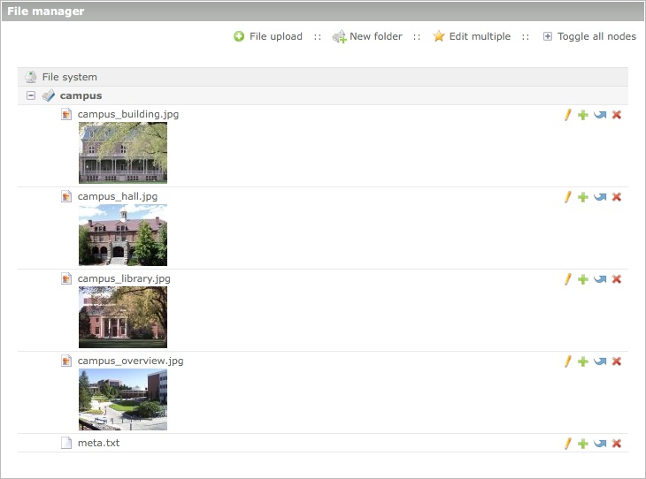
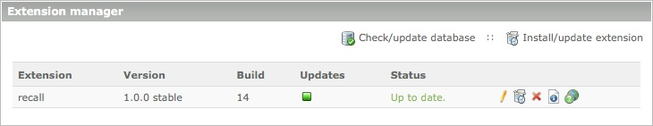
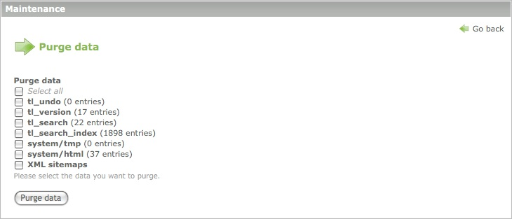

# System administration

The following chapters explain how to administrate Contao. Besides installing
and updating the application, an administrator is responsible for creating users
and groups, managing additional modules and maintaining the system.

## Users and groups

Contao distinguishes between back end users ("users"), who can log into the
administration area, and front end users ("members"), who can log into the
website. Unlike administrators, who have access to all pages and elements by
default ("allow all"), regular users cannot access any resource that has not
been explicitly allowed in their profile or in the profile of one of the groups
they belong to ("deny all").

### Users

Each user can be associated with multiple groups and automatically inherits
their permissions. All permissions are additive, which means that a user
inherits the sum of permissions of all groups he belongs to. If group A grants a
certain right, you cannot revoke it in group B.

#### Pagemounts

Pagemounts define which pages of the site structure a user is allowed to see.
The screenshot below shows the site structure in the view of Helen Lewis.
Although the website contains a lot more pages, she can only see three, because
only the "Courses" page has been mounted in the settings of the "Editors" group.
Note that although Helen Lewis is allowed to see three pages, she can only edit
one of them!

Being able to see a page does not include the right to edit it (or its
articles). Remember that [page permissions][1] are set in the site structure, so
to enable a page for a user, you have to mount it in his profile and grant
access to it in the site structure.

#### Filemounts

Similar to pagemounts, filemounts define which folders a user is allowed to see.
Below is a sceenshot of the file manager in the view of Helen Lewis. She is only
allowed to see the "campus" folder, whereas administrators can see the whole
files directory (`tl_files`).

#### Allowed fields

As mentioned at the beginning, regular users do not have any default permissions
at all ("deny all"), which also implies that they cannot access any form fields.
Even if they are e.g. allowed to access the news module, the form to create a
new entry will be empty until the administrator enables one or more fields of
the `tl_news` table in the group settings.

### Members

Managing members (front end users) is a lot easier than managing back end users,
because there are no pagemounts or allowed fields. Member management is mainly
required to control access to protected pages, which is implemented on group
level. Depending on the website configuration, registered members will be able
to see protected pages or access protected downloads that are not available to
guests.

## Extensions

Extensions are an essential part of Contao, because they allow you to add extra
functionality. Currently there are 1,292 extensions available in the Contao
Extension Repository, which you can browse directly in the back end.
Communication with the repository server is done via SOAP, so you need to enable
the PHP SOAP extension to use the service (if not enabled by default).

### Extension catalog

The "extension catalog" module allows you to browse the extension list and to
install extensions at the push of a button. Use the filter and sorting options
to find a particular extension and click the info icon or extension title to
open the details page and install the module.

The details page contains a description of the extension and important
information regarding system requirements, versions and dependencies from other
modules. Click the "Install" button to download and install the extension.

Contao will automatically download and install the extension and update the
database if necessary.

### Extension manager

The "extension manager" module allows you to update and uninstall extensions. It
automatically checks for updates and notifies you if a new version is available.
Many extensions also include links to an online manual and/or forum thread where
you can get support.

To uninstall an extension, simply click the uninstall icon and follow the
instructions. The extension manager will remove all files and folders and update
the database if necessary. Note that this action cannot be undone and the tables
cannot be restored!

### Manual installation

In case the PHP SOAP extension is not available on your server, you can also
install Contao extensions manually. Find the respective module in the [extension
list][2] and download the .zip archive of the latest release. Then unzip the
files and copy them to your local or remote Contao directory. Finally, check the
database with the [Contao install tool][3].

## Maintenance

Most of the maintenance jobs in Contao are executed automatically by the
Periodic Command Scheduler, so you can focus on your actual work. Even the tasks
in the maintenance module are carried out automatically, however sometimes it is
necessary to trigger them manually.

### Purging data

Besides the user generated content, Contao stores a lot of system data which is
used to restore deleted records, revert back to prior versions, search the
website or decrease the page loading time. You can purge this data manually e.g.
to remove old thumbnails from the image cache or to recreate the XML sitemap
files after you have modified the site structure.

### Rebuilding the search index

Pages are usually added to the search index automatically when they are viewed
in the front end (unless you are logged into the back end at the same time), so
you do not need to worry about the search index. However if you have changed a
large number of pages, it is more convenient to update them all at once instead
of opening them one by one in the browser. In this case you can rebuild the
search index manually.

[1]: https://contao.org/en/page-types.html#access-rights
[2]: https://contao.org/en/extension-list.html
[3]: https://contao.org/en/installing-contao.html#install-tool
