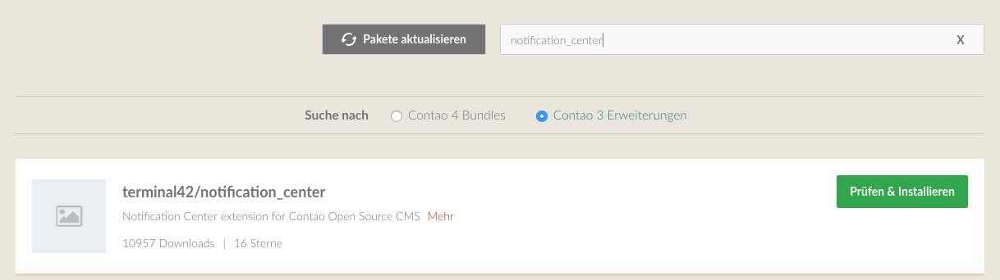

# Pakete / Erweiterungen mit dem Contao Manager verwalten

## Contao Manager öffnen

Sie müssen sich zunächst wieder am Contao Manager anmelden. Dazu rufen Sie
erneut Ihre Domain mit dem Zusatz `/contao-manager.phar.php` auf und geben Ihre
Zugangsdaten ein.

## Pakete aktualisieren

Mit einem Klick auf die Schaltfläche "Pakete aktualisieren" werden alle
installierten Pakete auf den aktuellen Stand gebracht.
D.h. dabei wird auch Contao 4 auf die neuste Version aktualisiert.

##  Pakete suchen

Klicken Sie dazu auf "Pakete installieren" und tippen anschließend Ihren
gewünschten Suchbegriff in das Suchfeld.

Mit den Optionen "Contao 4 Bundels" und "Contao 3 Erweiterungen" kann
festgelegt werden, nach welchen Paketen gesucht wird.

Je nachdem, ob der Entwickler seine Erweiterung schon als natives
*Contao 4 bundle* erstellt hat, müssen Sie ggf. auf "Contao 3 extensions"
umschalten.

Der Contao Manager kann nur Pakete finden, die über [packagist.org][1] gelistet
sind.

## Pakete installieren

Sie sollten nun eine Liste an Erweiterungen angezeigt bekommen. Wählen Sie das
gewünschte Paket aus und klicken auf "Prüfen & Installieren".

Es erscheint nun die Möglichkeit eine bestimmte Version festzulegen.
Klicken Sie dazu auf das Zahnradsymbol und tippen die gewünschte Version ein.

In Normalfall ist dies allerdings nicht nötig und Sie klicken auf
"Änderungen anwenden".

Nun startet der Contao Manager einen neuen Task und führt die Installation der
gewählten Erweiterung im Hintergrund durch.

> #### info:: Hinweis
> Im Moment lassen sich mehrere Pakete nur dann gleichzeitig
> installieren, wenn sich diese auf der selben Ergebnisseite befinden.*

### Installtool aufrufen

Der Contao Manager hat in der aktuellen Version keinen Zugriff auf die
Datenbank.

Aus diesem Grund müssen Sie nach jeder Paket-Installation auf die Schaltfläche
"Installtool" klicken und die Datenbank aktualisieren.

## Pakete deinstallieren

Wenn Sie eine Erweiterungen nicht mehr benötigen, klicken Sie in der Übersicht
auf die Schaltfläche "Entfernen" und anschießend auf "Änderungen anwenden".

Es wird erneut ein Task im Hintergrund ausgeführt. Anschließend müssen Sie
wieder das Installtool aufrufen und die Datenbank aktualisieren.

Bitte beachten Sie, dass die offiziellen Contao-Bundles ebenfalls in
dieser Liste aufgeführt sind und entfernt werden könnten.

[1]: https://packagist.org/
