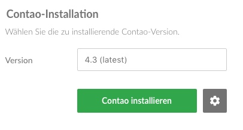
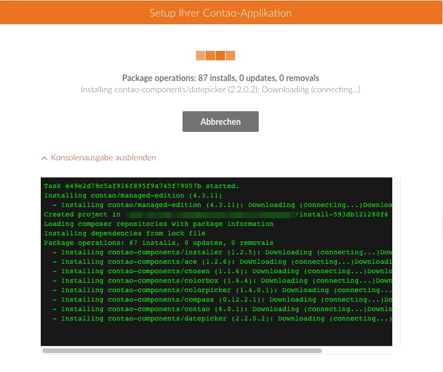
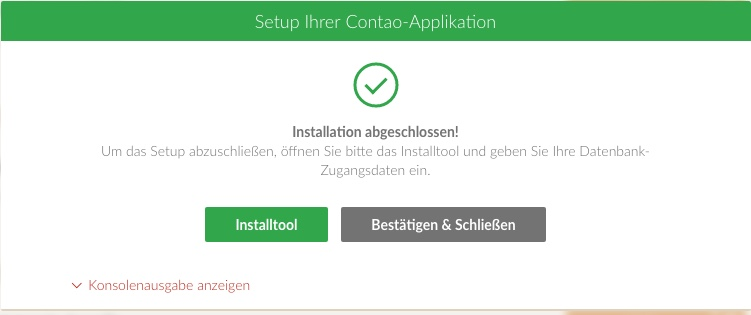

# Contao per Contao Manager installieren

Nach erfolgreicher Grundkonfiguration kann nun Contao installiert werden.
Dazu wählen Sie die gewünschte Version aus und klicken auf die Schaltfläche
"Contao installieren". 

Die Installation kann nun mehrere Minuten in Anspruch nehmen.
Details zum Installationsprozess können durch Klick auf
"Konsolenausgabe anzeigen" eingeblendet werden.

## Contao Installtool aufrufen

Sobald der Contao Manager alle Pakete installiert hat, klicken Sie auf die
Schaltfläche "Installtool".

Folgenden Sie den Anweisungen und vergeben zunächst ein Passwort.
Anschließend geben Sie die Daten für Ihre Datenbankverbindung ein und klicken
auf "Datenbank aktualisieren".

Zum Schluss legen Sie noch ein Administratorkonto für das Contao Backend an.
Sie können nun das Installtool schließen und beim Contao Manager auf
"Bestätigen & Schließen" klicken.

Sie haben nun erfolgreich Contao über den Contao Manager installiert.
