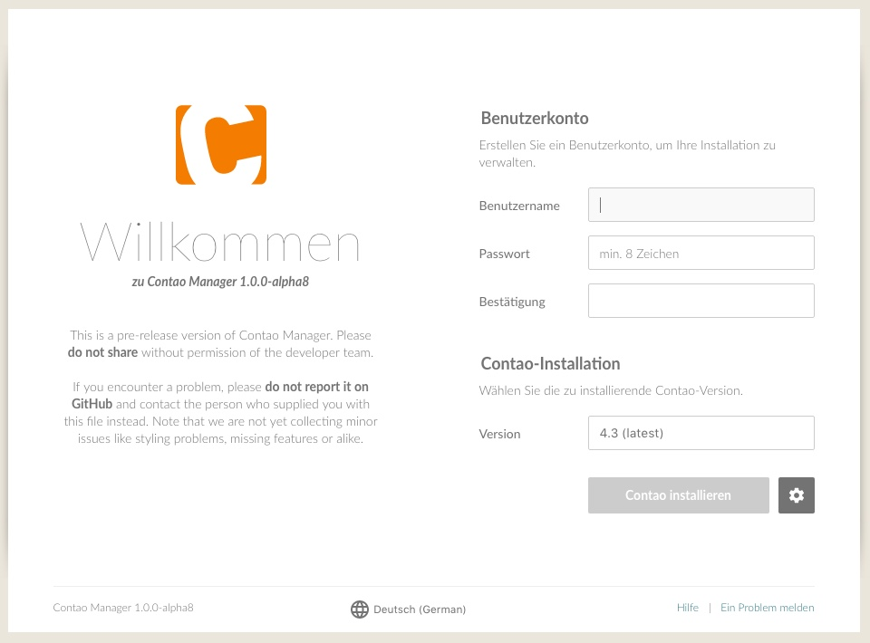
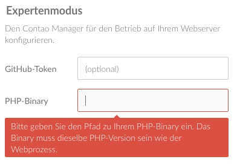

# Contao Manager installieren

## Anforderung Hosting / Systemvoraussetzungen
Die Voraussetzungen entsprechen denen von Contao 4. Ein Kompatibilitätstest kann
voher mit dem [Contao Check][1] durchgeführt werden.

## Kompatible Hoster
Die folgenden Hostinganbieter wurden bereits auf einen fehlerfreien Betrieb mit
dem Contao Manager und Contao 4 getestet.

Auf diese Daten besteht kein Anspruch auf Richtigkeit und Vollständigkeit.
Das Contao-Team bittet Sie um Ihre Mithilfe, diese Tabelle zu vervollständigen
und die Daten aktuell zu halten.



## Konfiguration Hosting
Die Domain darf **nicht** auf das Root-Verzeichnis zeigen, sondern muss auf das
Unterverzeichnis `web` konfiguriert sein.

**Beispiel:**
meinedomain.de zeigt auf das Verzeichnis www/meinedomain/web

*Hinweis*: Pro Contao Installation wird eine eigene (Sub)Domain benötigt.

## Download
Der Contao Manager besteht aus einer einzigen phar-Datei. Diese kann über
[contao.org][2] heruntergeladen werden.

## Entpacken und auf Webserver laden
Nach erfolgreichem Download muss die Datei entpackt werden. Sie sollten jetzt
eine Datei `contao-manager.phar.php` haben.
Diese wird per FTP-Upload auf den Webserver in das Verzeichnis `web` übertragen. 

## Contao Manager aufrufen
Anschließend rufen Sie mit Ihrem Browser die URL
`http://www.meinedomain.de/contao-manager.phar.php` auf.
Sie sollten nun den Willkommen-Screen des Contao Managers sehen.

## Grundkonfiguration
Bevor Sie nun Contao installieren, muss der Manager selbst konfiguriert werden.
Legen Sie dazu einen neuen Benutzer an, indem Sie einen Benutzernamen und ein
Passwort vergeben.
Das Passwort ist unabhängig von der späteren Contao Installation. Bitte notieren
Sie sich die Zugangsdaten.

Der Contao Manager benötigt keine eigene Datenbank.
Die Konfiguration wird in mehreren Dateinen im Unterordner `contao-manager`
gespeichert.

## PHP binary - Experten Einstellungen
Der Contao Manager versucht automatisch den PHP-Pfad zu erkennen.
Leider ist das nicht immer möglich, deswegen sollten Sie die Einstellung noch
einmal prüfen.

Wenn bereits eine Version erkannt wurde, müssten Sie zuerst auf das
"Zahnradsymbol" neben dem "Install-Button" klicken, damit die Einstellung
sichtbar wird.

Nun können Sie die [Contao Installation](installation-contao.md) starten

[1]: https://contao.org/de/download.html
[2]: https://github.com/contao/check