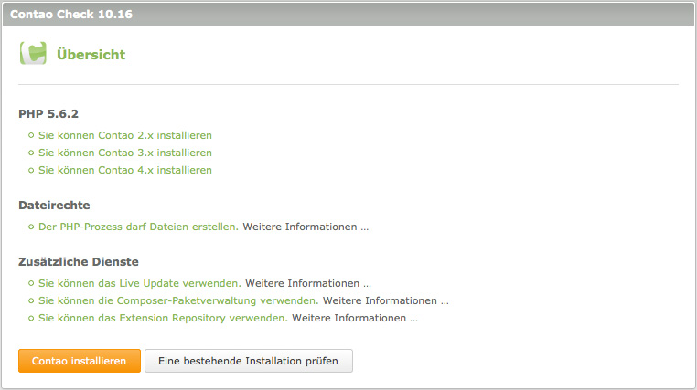

## Den Live-Server konfigurieren

In diesem Kapitel geht es nicht darum, den Apache-Dienst zu installieren oder
PHP zu kompilieren, was auf einem Shared-Hosting-Server ohnehin nicht möglich
ist. Stattdessen wird erklärt, wie man die Contao-Systemvoraussetzungen prüft
und PHP 5 aktiviert.

### Contao-Systemvoraussetzungen

Contao benötigt einen Webserver wie Apache oder IIS mit PHP- und MySQL-Support.
PHP muss mindestens in der Version 5.3.2 vorliegen und MySQL in der Version 5.0.
Außerdem benötigen Sie die PHP-Erweiterungen "GDlib" (Bildbearbeitung),
"DOM" (XML-Dateien) und "SOAP" (Extension Repository) sowie optional "mbstring"
(internationale Zeichen) und "mcrypt" (Verschlüsselung). Contao wurde erfolgreich
in allen modernen Browsern wie Firefox (ab Version 2) oder Internet Explorer
(ab Version 8) getestet.

### Der Contao-Check

Laden Sie den Contao-Check herunter und finden Sie heraus, ob Ihr Server die
Contao-Systemvoraussetzungen erfüllt. Der Contao-Check prüft, ob Sie das
Extension Repository und das Live Update nutzen können und ob Sie den Safe Mode
Hack benötigen oder nicht. Je nach Systemkonfiguration können Sie mit Hilfe des
Web-Installers eine neue Contao-Installation aufsetzen oder eine bestehende
Installation prüfen.

Entpacken Sie die Zip-Datei, übertragen Sie den Ordner
`check` in Ihr Contao-Verzeichnis und öffnen Sie ihn in einem Browser.

[Den Contao-Check herunterladen][1] | [Zum Projekt auf GitHub][2]

### Provider-spezifische Einstellungen

Es gibt ein paar wenige große Internet Service Provider, die spezielle
Einstellungen für den Betrieb von Contao erfordern. Zum Glück sind sie nur die
Ausnahme von der Regel. Die Provider-spezifische Einstellungen finden Sie im
[Contao-Forum][3]. Sorgenfreies Contao-Hosting erhalten Sie bei den
[Contao Hosting-Partnern][4].

[1]: https://github.com/contao/check/zipball/master
[2]: https://github.com/contao/check
[3]: https://community.contao.org/de/forumdisplay.php?67-Erfahrungen-mit-Webhostern
[4]: https://contao.org/de/partners.html?search=services&for=partner_hosting
