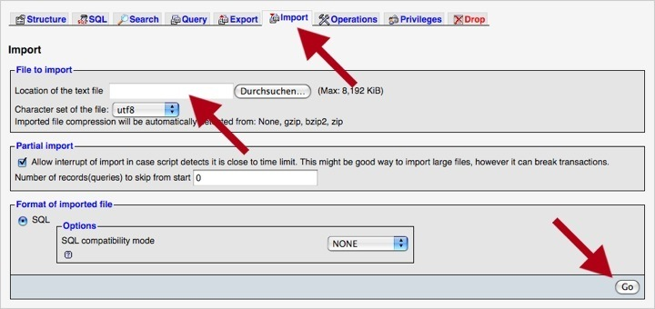

## Eine Installation umziehen

Der Umzug einer Contao-Installation von einem lokalen Server auf einen
Live-Server ist nicht viel anders als eine neue Installation, außer dass Sie die
Dateien Ihrer lokalen Installation statt denen des Contao-Archivs sowie einen
SQL-Dump Ihrer lokalen Datenbank verwenden.

### Dateien kopieren

Öffnen Sie Ihr FTP-Programm, verbinden Sie sich mit dem Zielserver und
übertragen Sie alle Dateien Ihrer lokalen Contao-Installation.

### Datenbank exportieren

Ein MySQL-Dump lässt sich am einfachsten mit der Datenbankverwaltung
"phpMyAdmin" erstellen. Als Serveradministrator können Sie natürlich auch das
Programm `mysqldump` verwenden. Melden Sie sich an "phpMyAdmin" an, wählen Sie
die zu exportierende Datenbank und klicken Sie auf die "Export"-Schaltfläche im
oberen Menü. Um Kompatibilitätsprobleme zwischen verschiedenen MySQL-Versionen
zu minimieren, ist es wichtig, die Einstellungen für den Export gemäß des
folgenden Screenshots anzupassen:

### Datenbank importieren

Öffnen Sie "phpMyAdmin" auf dem Zielserver und erstellen Sie eine neue
Datenbank für Contao. Je nach Serverkonfiguration ist das eventuell nur über die
Verwaltungsoberfläche (z.B. "Plesk" oder "cPanel") möglich. Wählen Sie die neue
leere Datenbank aus und klicken Sie auf die "Import"-Schaltfläche im oberen
Menü. Laden Sie dann den SQL-Dump der lokalen Datenbank hoch und starten Sie den
Import.

### Datenbank-Konfiguration anpassen

Als Letztes öffnen Sie das Contao-Installtool der neuen Installation (das
Passwort ist dasselbe wie für Ihre lokale Installation) und passen wenn nötig
die Datenbank-Zugangsdaten an. Danach können Sie sich wie gewohnt mit Ihrem
Benutzernamen im Backend anmelden.
