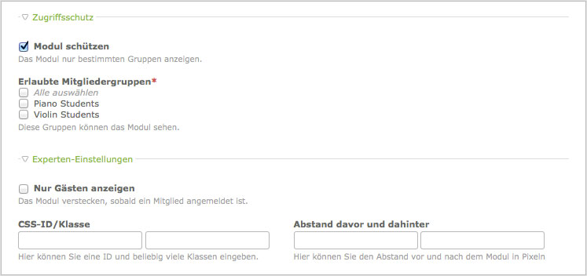

## Module

Mit Hilfe von Frontend-Modulen können Sie Ihre Webseite um fast jede erdenkliche
Funktionalität erweitern. Der Contao-Core enthält Module, um verschiedene
Navigationsmodule zu erstellen, die Benutzerregistrierung und -anmeldung zu
ermöglichen, die Webseite zu durchsuchen, RSS-Feeds zu importieren und vieles
mehr. Module können im Backend unter "Themes" -> "Frontend-Module" konfiguriert
werden.

<table>
<tr>
  <th>Modul</th>
  <th>CSS-Klasse</th>
  <th>Beschreibung</th>
</tr>
<tr>
  <td>Navigationsmenü</td>
  <td>mod_navigation</td>
  <td>Erzeugt ein Navigationsmenü aus der Seitenstruktur.</td>
</tr>
<tr>
  <td>Individuelle Navigation</td>
  <td>mod_customnav</td>
  <td>Erzeugt ein individuelles Navigationsmenü.</td>
</tr>
<tr>
  <td>Navigationspfad</td>
  <td>mod_breadcrumb</td>
  <td>Erzeugt einen Navigationspfad.</td>
</tr>
<tr>
  <td>Quicknavigation</td>
  <td>mod_quicknav</td>
  <td>Erzeugt ein Drop-Down-Menü aus der Seitenstruktur.</td>
</tr>
<tr>
  <td>Quicklink</td>
  <td>mod_quicklink</td>
  <td>Erzeugt ein individuelles Drop-Down-Menü.</td>
</tr>
<tr>
  <td>Buchnavigation</td>
  <td>mod_booknav</td>
  <td>Erzeugt ein Buchnavigationsmenü.</td>
</tr>
<tr>
  <td>Artikelnavigation</td>
  <td>mod_article_nav</td>
  <td>Erzeugt ein Seitenumbruch-Menü zur Artikelnavigation.</td>
</tr>
<tr>
  <td>Sitemap</td>
  <td>mod_sitemap</td>
  <td>Erzeugt eine Liste aller Seiten aus der Seitenstruktur.</td>
</tr>
<tr>
  <td>Login-Formular</td>
  <td>mod_login</td>
  <td>Erzeugt ein Anmeldeformular (Login).</td>
</tr>
<tr>
  <td>Automatischer Logout</td>
  <td>-</td>
  <td>Meldet einen Benutzer automatisch ab (Logout).</td>
</tr>
<tr>
  <td>Persönliche Daten</td>
  <td>mod_personalData</td>
  <td>Erzeugt ein Formular zur Bearbeitung der Benutzerdaten.</td>
</tr>
<tr>
  <td>Registrierung</td>
  <td>mod_registration</td>
  <td>Erzeugt ein Formular zur Benutzerregistrierung.</td>
</tr>
<tr>
  <td>Passwort ändern</td>
  <td>mod_changePassword</td>
  <td>Erzeugt ein Formular zur Passwort-Änderung.</td>
</tr>
<tr>
  <td>Passwort vergessen</td>
  <td>mod_password</td>
  <td>Erzeugt ein Formular zur Passwort-Anforderung.</td>
</tr>
<tr>
  <td>Konto schließen</td>
  <td>mod_closeAccount</td>
  <td>Erzeugt ein Formular zur Löschung eines Benutzerkontos.</td>
</tr>
<tr>
  <td>Nachrichtenliste</td>
  <td>mod_newslist</td>
  <td>Fügt der Seite eine Nachrichtenliste hinzu.</td>
</tr>
<tr>
  <td>Nachrichtenleser</td>
  <td>mod_newsreader</td>
  <td>Stellt einen einzelnen Nachrichtenbeitrag dar.</td>
</tr>
<tr>
  <td>Nachrichtenarchiv</td>
  <td>mod_newsarchive</td>
  <td>Fügt der Seite ein Nachrichtenarchiv hinzu.</td>
</tr>
<tr>
  <td>Nachrichtenarchiv-Menü</td>
  <td>mod_newsmenu</td>
  <td>Erzeugt ein Menü zur Navigation des Nachrichtenarchivs.</td>
</tr>
<tr>
  <td>Kalender</td>
  <td>mod_calendar</td>
  <td>Fügt der Seite einen Kalender hinzu.</td>
</tr>
<tr>
  <td>Eventleser</td>
  <td>mod_eventreader</td>
  <td>Stellt ein einzelnes Event dar.</td>
</tr>
<tr>
  <td>Eventliste</td>
  <td>mod_eventlist</td>
  <td>Listet alle Events eines bestimmten Zeitraums auf.</td>
</tr>
<tr>
  <td>Eventliste-Menü</td>
  <td>mod_eventmenu</td>
  <td>Erzeugt ein Menü zur Navigation der Eventliste.</td>
</tr>
<tr>
  <td>Abonnieren</td>
  <td>mod_subscribe</td>
  <td>Erzeugt ein Formular zum Abonnieren von Verteilern.</td>
</tr>
<tr>
  <td>Kündigen</td>
  <td>mod_unsubscribe</td>
  <td>Erzeugt ein Formular zum Kündigen von Abonnements.</td>
</tr>
<tr>
  <td>Newsletterliste</td>
  <td>mod_nl_list</td>
  <td>Fügt der Seite eine Newsletterliste hinzu.</td>
</tr>
<tr>
  <td>Newsletterleser</td>
  <td>mod_nl_reader</td>
  <td>Stellt einen einzelnen Newsletter dar.</td>
</tr>
<tr>
  <td>FAQ-Liste</td>
  <td>mod_faqlist</td>
  <td>Fügt der Seite eine Liste häufig gestellter Fragen hinzu.</td>
</tr>
<tr>
  <td>FAQ-Leser</td>
  <td>mod_faqreader</td>
  <td>Stellt die Antwort zu einer häufig gestellten Frage dar.</td>
</tr>
<tr>
  <td>FAQ-Seite</td>
  <td>mod_faqpage</td>
  <td>Gibt die FAQ-Liste und den FAQ-Leser auf derselben Seite aus.</td>
</tr>
<tr>
  <td>Formular</td>
  <td>mod_form</td>
  <td>Fügt der Seite ein Formular hinzu.</td>
</tr>
<tr>
  <td>Suchmaschine</td>
  <td>mod_search</td>
  <td>Fügt der Seite ein Suchfomular hinzu.</td>
</tr>
<tr>
  <td>Kommentare</td>
  <td>mod_comments</td>
  <td>Kommentare bzw. Gästebuch-Einträge verwalten.</td>
</tr>
<tr>
  <td>Auflistung</td>
  <td>mod_listing</td>
  <td>Listet die Daten einer beliebigen Tabelle auf.</td>
</tr>
<tr>
  <td>Flash-Film</td>
  <td>mod_flash</td>
  <td>Bindet einen Flash-Film in eine Seite ein.</td>
</tr>
<tr>
  <td>Artikelliste</td>
  <td>mod_article_list</td>
  <td>Erzeugt eine Liste aller Artikel einer Spalte.</td>
</tr>
<tr>
  <td>Zufallsbild</td>
  <td>mod_random_image</td>
  <td>Fügt der Seite ein zufällig ausgewähltes Bild hinzu.</td>
</tr>
<tr>
  <td>Eigener HTML-Code</td>
  <td>-</td>
  <td>Erlaubt das Hinzufügen von eigenem HTML-Code.</td>
</tr>
<tr>
  <td>RSS-Reader</td>
  <td>mod_rss_reader</td>
  <td>Fügt der Seite einen RSS-Feed hinzu.</td>
</tr>
</table>

### Zugriffsschutz

Jedes Frontend-Modul kann geschützt werden, so dass es nur Gäste oder Benutzer
einer bestimmten Mitgliedergruppe sehen können.

