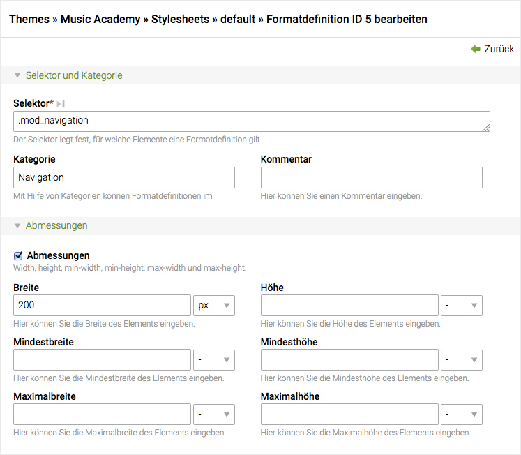

## Stylesheets

Barrierefreie Webseiten sollten immer mit CSS formatiert werden, daher enthält
Contao ein "Stylesheets"-Modul, mit dem Sie Formatdefinitionen bequem im Backend
verwalten können. Um die verschiedenen Contao-Elemente und -Module in einem
Stylesheet zu referenzieren, müssen Sie deren Klassennamen kennen.
[Inhaltselement-Klassen][1] beginnen mit "ce\_" (z.B. "ce\_text")
und [Modul-Klassen][2] mit "mod\_" (z.B. "mod\_search"). Falls
Sie sich nicht sicher sind, sehen Sie einfach im Quelltext der Webseite nach.



Jedes Stylesheet kann auf einen oder mehrere Medientypen und/oder eine bestimmte
Version des Internet Explorers beschränkt werden, falls Sie einen der vielen
darin enthaltenen Fehler gesondert beheben müssen. Achten Sie dabei auf die
Reihenfolge der Formatdefinitionen, da frühere Anweisungen von späteren
überschrieben werden können.


### CSS-Klassen der Include-Elemente

Wird ein Modul durch ein Inhaltselement eingebunden, werden die CSS-Klassen
in beiden Konfigurationen zusammengeführt statt überschrieben. Hat das
Inhaltselement A die CSS-Klasse `elemA` und fügt ein Frontend-Modul mit der 
CSS-Klasse `elemB` ein, werden beide CSS-Klassen ausgegeben
(`class="elemA elemB"`).

Hier ein Beispiel um die Elemente separat anzusprechen:

```css
.elemA {
    /* Nur Inhaltselement */
}

.elemB {
    /* Inhaltselement und Frontend-Modul */
}

.elemB:not(.elemA) {
    /* Nur Frontend-Modul */
}
```


[1]: ../04-inhalte-verwalten/artikel.md#artikel
[2]: ../03-seiten-verwalten/module.md#module
