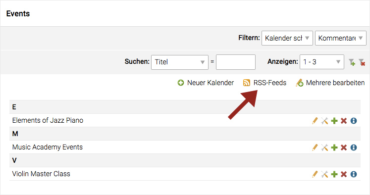
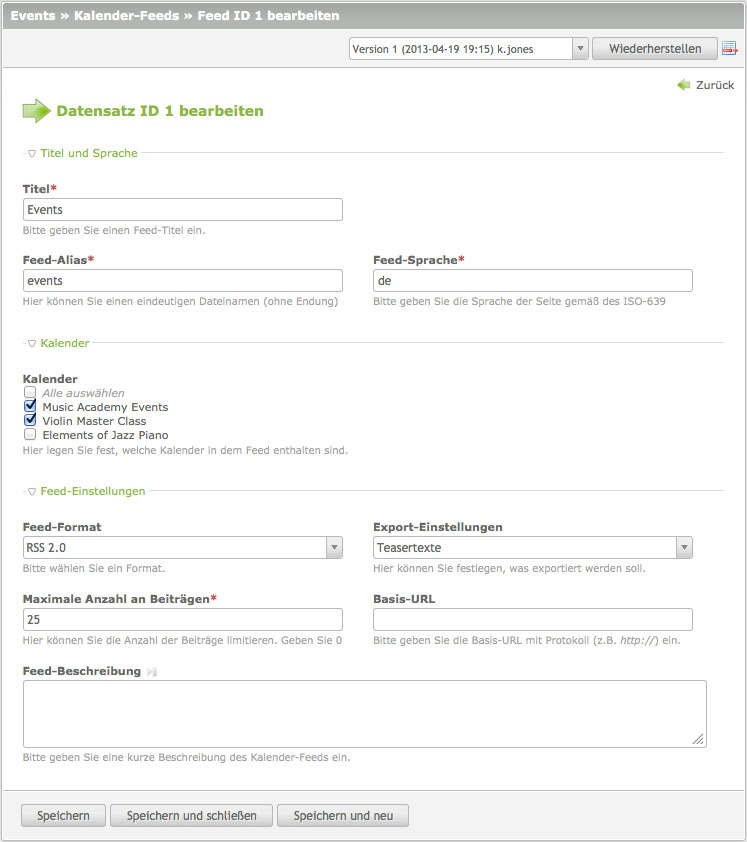

## RSS-/Atom-Feed

Diese Funktion ist für News Archive und Kalender verfügbar.
Hier ein Beispiel der Kalender-Liste.

### Einstellungen

Ein oder mehrere Kalender können gruppiert und als RSS- bzw. Atom-Feed
ausgegeben werden. Genau gleich funktioniert es bei News Archiven. Hier kann
auch gewählt werden, ob nur der Teaser oder der komplette Artikel des Events
bzw. der News ausgegeben werden soll.

### XML Dateien

Die XML Dateien werden automatisch generiert und im `share` Verzeichnis
Ihrer Contao Installation abgelegt. In diesem Beispiel: `share/events.xml`.
