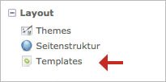

## Templates

Ein Template enthält meist HTML und PHP code. Es wird zur Ausgabe von Inhalten
eines Moduls oder Inhaltelements etc. verwendet. Beispielsweise gibt das
Template `news_full.html5` eine vollständige Nachricht aus, während das Template
`news_short.html5` nur einen Teil davon anzeigt.

Templates befinden sich direkt in den dazugehören Modulen. Das `news_full.html5`
Template befindet sich beispielsweise in `system/modules/news/templates/news`.

Falls diese Datei direkt in diesem Ordner bearbeitet wird, **gehen die Änderungen**
bei einem nächsten Update von Contao **verloren**. Um dies zu vermeiden,
Templates können im Backend bearbeitet werden. Dabei wird die Datei kopiert um
Änderungen während einem Update nicht zu verlieren.

Unter dem Menüpunkt *Templates* können die Dateien bearbeitet und in Ordnern
abgelegt werden. Ordner müssen wie unter [Theme-Bestandteile][1] beschrieben
einem Theme zugewiesen sein.

Ein Template gehört zu einem Modul, einem Inhaltselement, einem Formular oder
anderen Komponenten. Sie werden zur einfacheren Erkennung deshalb meist mit
einem Präfix versehen. Beispielsweise deutet `j_` auf jQuery oder `nl_` auf
ein Newsletter-Template.

[1]: ../03-seiten-verwalten/themes.md#theme-bestandteile
