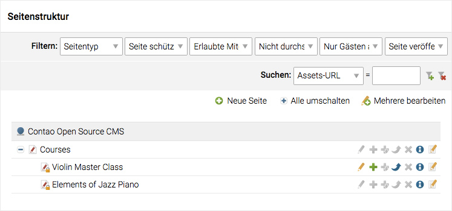
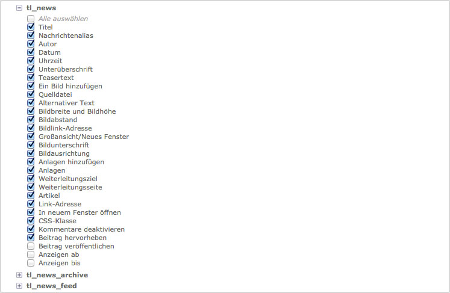

## Benutzer und Gruppen

Contao unterscheidet zwischen Backend-Benutzern ("Benutzer"), die sich am
Administrationsbereich anmelden können, und Frontend-Benutzern
("Mitglieder"), die sich auf der Webseite anmelden können. Im Gegensatz
zu Administratoren, die standardmäßig alle Seiten und Elemente
bearbeiten dürfen ("allow all"), können reguläre Benutzer nur auf
die Ressourcen zugreifen, die explizit in ihrem Profil oder dem Profil einer der
Gruppen, denen sie angehören, freigeschaltet wurden ("deny all").

### Benutzer

Jeder Benutzer kann mehreren Gruppen angehören und erbt automatisch deren
Rechte. Zugriffsrechte sind additiv, das heißt ein Benutzer erbt die Summe der
Rechte aller seiner Gruppen. Wird ein bestimmtes Recht in Gruppe A vergeben,
kann es nicht in Gruppe B widerrufen werden.

#### Pagemounts

Pagemounts legen fest, welche Seiten ein Benutzer in der Seitenstruktur sehen
kann. Der nachfolgende Screenshot zeigt die Seitenstruktur aus Sicht von Helen
Lewis. Obwohl die Webseite wesentlich mehr Seiten enthält, kann sie nur drei
davon sehen, denn nur die "Courses"-Seite wurde in in der "Editors"-Gruppe
gemountet. Beachten Sie außerdem, dass Helen Lewis nur eine der drei Seiten
bearbeiten kann!

Eine Seite sehen zu können, beinhaltet noch nicht das Recht, sie zu bearbeiten.
Erinnern Sie sich, dass [Zugriffsrechte][1] in der Seitenstruktur vergeben
werden, daher muss eine Seite sowohl im Benutzerprofil gemountet, als auch in
der Seitenstruktur freigeschaltet werden.

#### Filemounts

Filemounts legen fest, welche Verzeichnisse ein Benutzer in der Dateiverwaltung
sehen kann. Der nachfolgende Screenshot zeigt den Dateimanager aus Sicht von
Helen Lewis, die im Gegensatz zum Administrator nur auf den `campus`-Ordner
zugreifen darf.

#### Erlaubte Felder

Wie oben erwähnt, haben reguläre Benutzer standardmäßig überhaupt keine
Rechte ("deny all"), dürfen also auch nicht auf Formularfelder zugreifen.
Selbst wenn sie also beispielsweise das Nachrichten-Modul aufrufen könnten,
wäre das Formular zum Anlegen eines Beitrags solange leer, bis der
Administrator in den Gruppenrechten eines oder mehrere Felder der Tabelle
`tl_news` freigeschaltet hat.

### Mitglieder

Die Verwaltung von Mitgliedern (Frontend-Benutzern) ist viel simpler als die von
Backend-Benutzern, weil es keine Pagemounts oder erlaubte Felder gibt. Die
Mitgliederverwaltung wird hauptsächlich benötigt, um den auf Gruppenebene
implementierten Zugriffsschutz für Seiten zu kontrollieren. Je nach
Konfiguration können registrierte Mitglieder geschützte Seiten oder Downloads
aufrufen, die für Gäste nicht erreichbar sind.

#### Frontend-Vorschau

Als Administrator können Sie sich als jedes Mitglied anmelden und die Webseite
mit den entsprechenden Berechtigungen prüfen. Diese Option ist in der
Mitgliederliste verfügbar.

Das Frontend erscheint mit der Vorschau-Toolbar, in welcher zwischen den
Mitgliedern gewechselt werden kann. Ausserdem können durch die entsprechende
Option alle unveröffentlichten Elemente der angezeigt werden.

[1]: ../03-seiten-verwalten/module.md#zugriffsschutz
