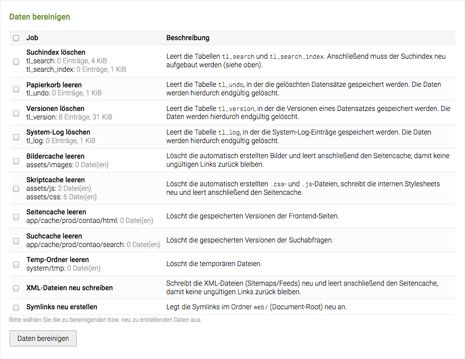
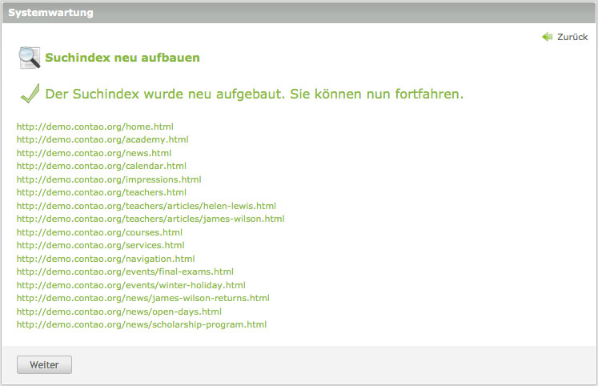

## Systemwartung

Die meisten Wartungsaufgaben in Contao sind automatisiert, so dass Sie sich auf
Ihre eigentliche Arbeit konzentrieren können. Manchmal kann es jedoch notwendig
sein, die sonst automatisch ausgeführten Aufgaben der Systemwartung manuell zu
starten.

### Daten bereinigen

Neben den Benutzer-generierten Inhalten speichert Contao verschiedene
Systemdaten, die für die Suche oder das Wiederherstellen gelöschter
Datensätze oder früherer Versionen verwendet werden. Sie können diese Daten
manuell bereinigen, um z.B. alte Vorschaubilder zu entfernen oder die
XML-Sitemaps nach einer Änderung an der Seitenstruktur zu aktualisieren.

### Suchindex neu aufbauen

Seiten werden automatisch beim Aufruf im Frontend indiziert (es sei denn Sie
sind parallel im Backend angemeldet), daher müssen Sie sich um den Suchindex
normalerweise keine Gedanken machen. Wenn Sie allerdings viele Seiten auf einmal
aktualisiert haben, ist es bequemer, den Suchindex manuell neu aufzubauen, als
alle geänderten Seiten einzeln im Browser aufzurufen.

