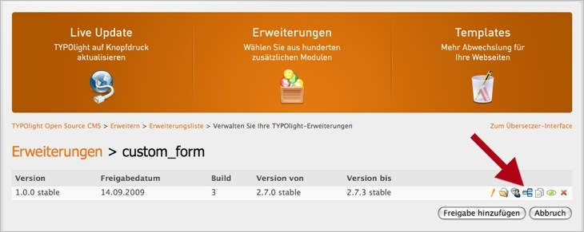

## Abhängigkeiten speichern

Unter Umständen nutzen Sie in einer Ihrer Erweiterungen die Funktionalität
einer anderen wie z.B. Cronjobs. Für den Betrieb Ihrer Erweiterung ist es also
zwingend notwendig, dass auch die Cron-Erweiterung installiert ist, was im
allgemeinen Sprachgebrauch als "Abhängigkeit" bezeichnet wird. Diese
Abhängigkeiten können im Extension Repository gespeichert werden, so dass bei
der Installation einer Erweiterung automatisch alle für deren Betrieb
benötigten Module ebenfalls installiert werden.

Wählen Sie als Erstes die Erweiterung aus, die Sie als Abhängigkeit
hinzufügen möchten, und bestätigen Sie Ihre Auswahl mit "Weiter". Im
nächsten Schritt können Sie die Versionen festlegen, die für den
reibungslosen Betrieb mindestens und höchstens erforderlich sind.
