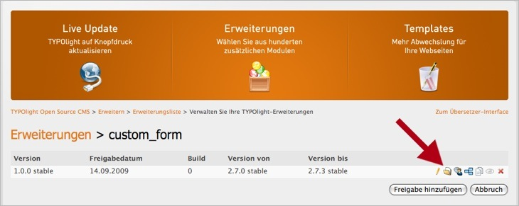

## Die Dateien hochladen

Als Nächstes müssen Sie dem neuen Release Dateien hinzufügen. Wechseln Sie
dazu in die Dateiverwaltung und klicken Sie dort auf die Schaltfläche "Dateien
hinzufügen/aktualisieren". Sie können nun einzelne Dateien oder ganze
Zip-Archive auf den Server übertragen. Achten Sie dabei darauf, das richtige
Zielverzeichnis auszuwählen, damit die Pfade nach dem Upload stimmen.

