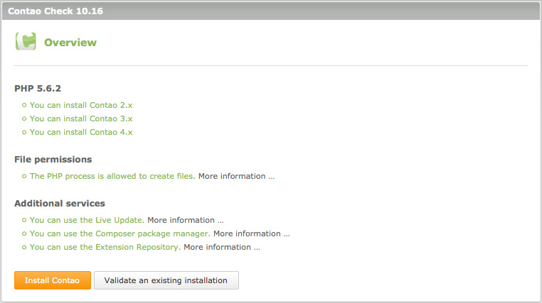

## Configuring the live server

This chapter is not about configuring a server in terms of installing Apache or
compiling PHP, which you cannot do on a shared hosting account anyway. It
explains how to check whether the Contao system requirements are met and how to
enable PHP 5.

### Contao system requirements

Contao requires a webserver like Apache or IIS with PHP and MySQL support. The
minimum PHP version is 5.4.0 and the minimum MySQL version is 5.5.3.
You also need the PHP extensions "GDlib" (image resizing), "DOM" (XML files),
"SOAP" (Extension Repository), "Phar" (Live Update) and optionally "mbstring"
(multi-byte character handling) as well as "mcrypt" (data encryption).
Contao has been tested successfully with all major browsers like Firefox
(from version 2) or Internet Explorer (from version 8).

### The Contao check

Download the Contao Check to find out whether your server meets the Contao
system requirements. The script will check whether you can use the Extension
Repository and the Live Update. Depending on your system configuration, you
can set up a new Contao installation with the web installer or validate an
existing installation.

Extract the Zip file, upload the `check` folder to your Contao installation
directory and open it in a web browser.

[Download the Contao Check][1] | [Open the GitHub project][2]

### ISP-specific settings

There are a few major Internet Service Providers that require a little extra
configuration to get Contao to work. Fortunately, they are just the exception
from the rule. The ISP-specific settings are described in the [Contao
forum][3]. If you are looking for hassle-free Contao hosting, check out the
list of [Contao hosting partners][4].

[1]: https://github.com/contao/check/zipball/master
[2]: https://github.com/contao/check
[3]: https://community.contao.org/en/
[4]: https://contao.org/en/partners.html?search=services&for=partner_hosting
