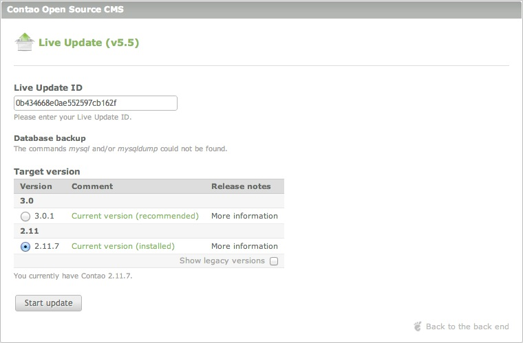

## Live Update Service

The Contao Live Update Service is a commercial Contao add-on provided by [iNet
Robots][1], the company of the Contao founder and core developer, Leo Feyer. It
allows you to update your installation with a only few clicks in the back end,
without having to download a Contao archive or using an FTP program to replace
or synchronize files.

[Sign up for a Live Update ID][2]

The Live Update includes the following features:

* Arbitrary up- and downgrades to any Contao version
* Automatic database backup before the update
* Individual validation and completion of the Contao installation
* Comparison of the customized templates and the original files

### Version selection

### Template differences

### Troubleshooting

99% of all Live Update issues are caused by wrong file permissions. Contao
requires write permissions to manage files and folders, therefore if the Live
Update does not work properly, check your server configuration and make sure to
set up the Safe Mode Hack **as described in this user guide**!

#### How to get support

If you are having problems activating your Live Update ID or receiving the
update archive, please contact the [iNet Robots support][3]. If you are having
problems configuring the Safe Mode Hack or using Contao, please choose a support
option on the [support page][4].

[1]: http://www.inetrobots.com
[2]: https://update.contao.org/
[3]: https://update.contao.org/en/support.html
[4]: https://contao.org/en/support.html
