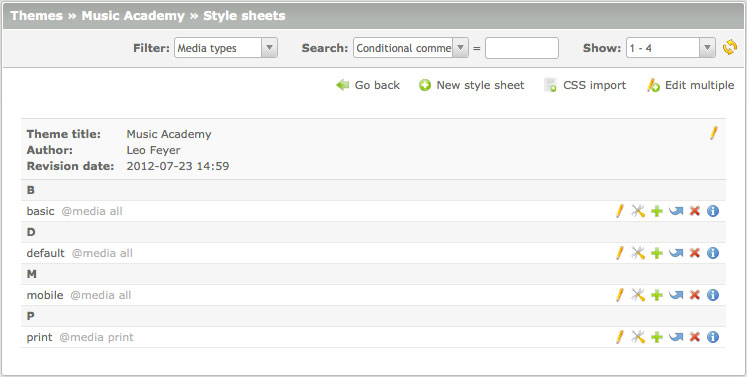
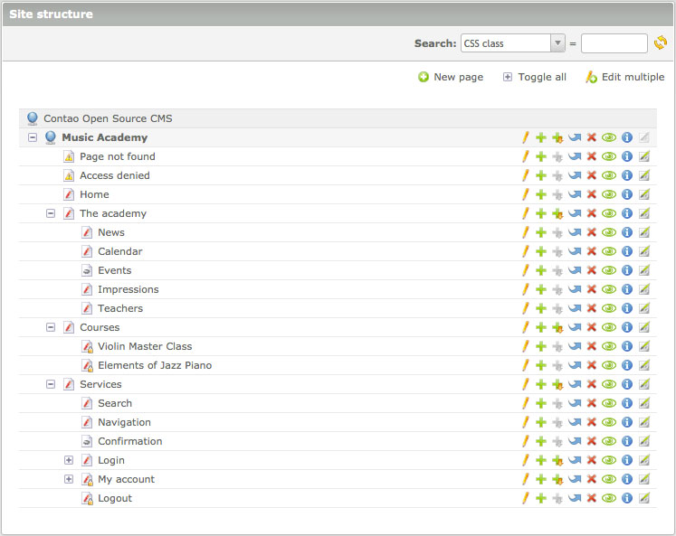

## Listing records

The Contao core engine supports three views: a simple list ("list view"), a list
that is grouped by its parent table ("parent view") and a hierarchical list
("tree view"). These three views can be used to list the records of any table or
related tables.

### List view

The "list view" lists the records of a single table in a particular order. The
results are usually grouped by their first letter.

### Parent view

The "parent view" lists the records of a child table that are related to a
particular record of a parent table. Parent-child relations are used a lot in
Contao, e.g. for articles and content elements, news archives and news articles
or style sheets and format definitions.

### Tree view

The "tree view" lists records and other resources like files and folders that
are organized in a hierarchical structure. Contao supports listing single
hierarchical tables (e.g. the site structure) as well as child tables that
relate to hierarchical parent tables (e.g. articles and pages).

### Sorting and filtering data

Contao supports various ways to refine results so you do not lose track even if
a table has several thousands of rows. A lot of listings can be filtered by one
or more fields so they only show the records matching the filter criteria. Most
listings additionally offer a full text search that even supports regular
expressions. To keep the page loading time down to a minimum, Contao only shows
30 records at a time.

