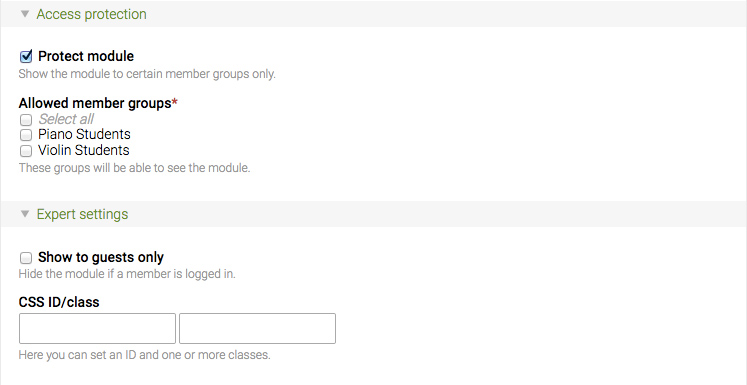

## Modules

Front end modules allow you to add almost any kind of functionality to your
website. The Contao core includes modules to generate various navigation menus,
handle user registration and authentication, search the website, import RSS
feeds and many more. To create a module, log into the back end and choose
"Themes" -> "Front end modules" in the navigation menu.

<table>
<tr>
  <th>Module</th>
  <th>CSS class</th>
  <th>Description</th>
</tr>
<tr>
  <td>Navigation menu</td>
  <td>mod_navigation</td>
  <td>Generates a navigation menu from the site structure.</td>
</tr>
<tr>
  <td>Custom navigation</td>
  <td>mod_customnav</td>
  <td>Generates a custom navigation menu.</td>
</tr>
<tr>
  <td>Breadcrumb navigation</td>
  <td>mod_breadcrumb</td>
  <td>Generates a breadcrumb navigation menu.</td>
</tr>
<tr>
  <td>Quick navigation</td>
  <td>mod_quicknav</td>
  <td>Generates a drop-down menu from the site structure.</td>
</tr>
<tr>
  <td>Quick link</td>
  <td>mod_quicklink</td>
  <td>Generates a custom drop-down menu.</td>
</tr>
<tr>
  <td>Book navigation</td>
  <td>mod_booknav</td>
  <td>Generates a book navigation menu.</td>
</tr>
<tr>
  <td>Article navigation</td>
  <td>mod_articlenav</td>
  <td>Generates a pagination menu to navigate articles.</td>
</tr>
<tr>
  <td>Sitemap</td>
  <td>mod_sitemap</td>
  <td>Generates a list of all pages in the site structure.</td>
</tr>
<tr>
  <td>Login form</td>
  <td>mod_login</td>
  <td>Generates a login form.</td>
</tr>
<tr>
  <td>Automatic logout</td>
  <td>-</td>
  <td>Automatically logs out a user.</td>
</tr>
<tr>
  <td>Personal data</td>
  <td>mod_personalData</td>
  <td>Generates a form to edit a user's personal data.</td>
</tr>
<tr>
  <td>Registration</td>
  <td>mod_registration</td>
  <td>Generates a user registration form.</td>
</tr>
<tr>
  <td>Change password</td>
  <td>mod_changePassword</td>
  <td>Generates a form to change the password.</td>
</tr>
<tr>
  <td>Lost password</td>
  <td>mod_password</td>
  <td>Generates a form to request a new password.</td>
</tr>
<tr>
  <td>Close account</td>
  <td>mod_closeAccount</td>
  <td>Generates a form to delete a member account.</td>
</tr>
<tr>
  <td>Newslist</td>
  <td>mod_newslist</td>
  <td>Adds a list of news items to the page.</td>
</tr>
<tr>
  <td>Newsreader</td>
  <td>mod_newsreader</td>
  <td>Shows the details of a news item.</td>
</tr>
<tr>
  <td>News archive</td>
  <td>mod_newsarchive</td>
  <td>Adds a news archive to the page.</td>
</tr>
<tr>
  <td>News archive menu</td>
  <td>mod_newsmenu</td>
  <td>Generates a navigation menu to browse the news archive.</td>
</tr>
<tr>
  <td>Calendar</td>
  <td>mod_calendar</td>
  <td>Adds a calendar to the page.</td>
</tr>
<tr>
  <td>Event reader</td>
  <td>mod_eventreader</td>
  <td>Shows the details of an event.</td>
</tr>
<tr>
  <td>Event list</td>
  <td>mod_eventlist</td>
  <td>Adds a list of events to the page.</td>
</tr>
<tr>
  <td>Event list menu</td>
  <td>mod_eventmenu</td>
  <td>Generates a navigation menu to browse the event list.</td>
</tr>
<tr>
  <td>Subscribe</td>
  <td>mod_subscribe</td>
  <td>Generates a form to subscribe to one or more channels.</td>
</tr>
<tr>
  <td>Unsubscribe</td>
  <td>mod_unsubscribe</td>
  <td>Generates a form to unsubscribe from one or more channels.</td>
</tr>
<tr>
  <td>Newsletter list</td>
  <td>mod_nl_list</td>
  <td>Adds a list of newsletters to the page.</td>
</tr>
<tr>
  <td>Newsletter reader</td>
  <td>mod_nl_reader</td>
  <td>Shows the details of a newsletter.</td>
</tr>
<tr>
  <td>FAQ list</td>
  <td>mod_faqlist</td>
  <td>Adds a list of frequently asked questions to the page.</td>
</tr>
<tr>
  <td>FAQ reader</td>
  <td>mod_faqreader</td>
  <td>Shows the answer to a frequently asked question.</td>
</tr>
<tr>
  <td>FAQ page</td>
  <td>mod_faqpage</td>
  <td>Shows the FAQ list and FAQ reader on the same page.</td>
</tr>
<tr>
  <td>Form</td>
  <td>mod_form</td>
  <td>Adds a form to a page.</td>
</tr>
<tr>
  <td>Search engine</td>
  <td>mod_search</td>
  <td>Adds a search form to a page.</td>
</tr>
<tr>
  <td>Comments</td>
  <td>mod_comments</td>
  <td>Manage comments or guestbook entries.</td>
</tr>
<tr>
  <td>Listing</td>
  <td>mod_listing</td>
  <td>Lists the records of a table.</td>
</tr>
<tr>
  <td>Flash movie</td>
  <td>mod_flash</td>
  <td>Embeds a Flash movie into a page.</td>
</tr>
<tr>
  <td>Article list</td>
  <td>mod_articlelist</td>
  <td>Generates a list of articles of a column.</td>
</tr>
<tr>
  <td>Random image</td>
  <td>mod_randomImage</td>
  <td>Adds a random image to a page.</td>
</tr>
<tr>
  <td>Custom HTML</td>
  <td>-</td>
  <td>Allows you to add custom HTML code.</td>
</tr>
<tr>
  <td>RSS reader</td>
  <td>mod_rssReader</td>
  <td>Adds an RSS feed to a page.</td>
</tr>
</table>

### Access control

Each front end module can be protected so only guests or members of a particular
group can see it on the website.

