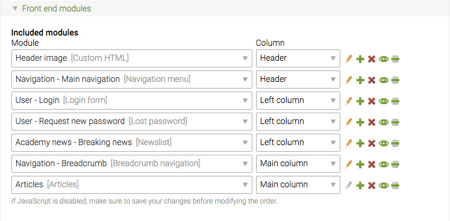

## Page layouts

Page layouts determine the basic page setup, e.g. the number of columns or the
overall width, and they define which front end modules are shown in which
columns. They also allow you to include style sheets, to link to RSS or Atom
feeds, to associate a Google Analytics ID and to add arbitrary JavaScript code
that is required to control interactive elements and plugins. The Contao CSS
framework automatically divides the browser window into several layout sections
and shows the modules that have been assigned to them one below the other.

That implies that by the time you create a page layout, you have to have created
all style sheets and front end modules that you want to include in it. Therefore
it is recommended to create resources in the following order:

* Create the necessary front end modules
* Create the necessary style sheets
* Optionally create news archives or calendars
* Create a new page layout and combine the components
