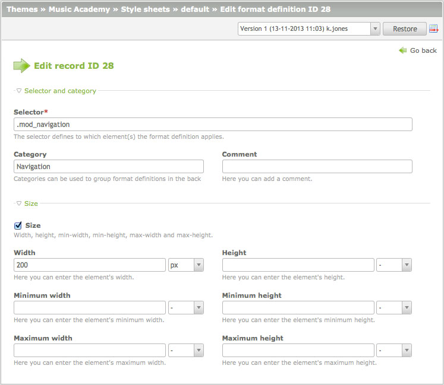

## Style sheets

Accessible websites should always be styled using CSS, that is why Contao
includes a "style sheets" module which allows you to manage format definitions
in the back end. To reference the various Contao elements, you need to know
their class names. [Content element classes][1] start with "ce\_"
(e.g. "ce\_text") and [module classes][2] with "mod\_"
(e.g. "mod\_search"). If you are not sure, simply look into the page source.



Every style sheet can be limited to one or more media types and/or to a
particular Internet Explorer version, in case you need to fix one of its
numerous bugs. Pay attention to the order of the format definitions, because
later commands override earlier ones.

### CSS classes of included elements

If an element is included in another element, the CSS classes are now merged
instead of overwritten, e.g. if content element A has the CSS class `elemA` and
includes a front end module with the CSS class `elemB`, both CSS classes will
be applied (`class="elemA elemB"`).

Here's how to select the elements separately:

```CSS
.elemA {
    /* Content element only */
}

.elemB {
    /* Content element and front end module */
}

.elemB:not(.elemA) {
    /* Front end module only */
}
```


[1]: ../04-managing-content/articles.md#articles
[2]: ../03-managing-pages/modules.md#modules
