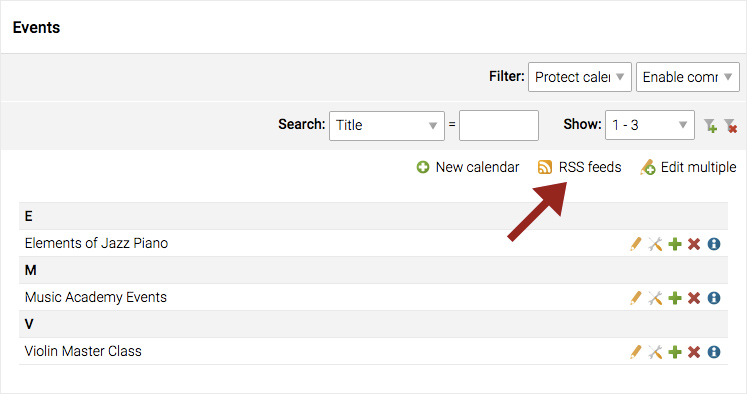
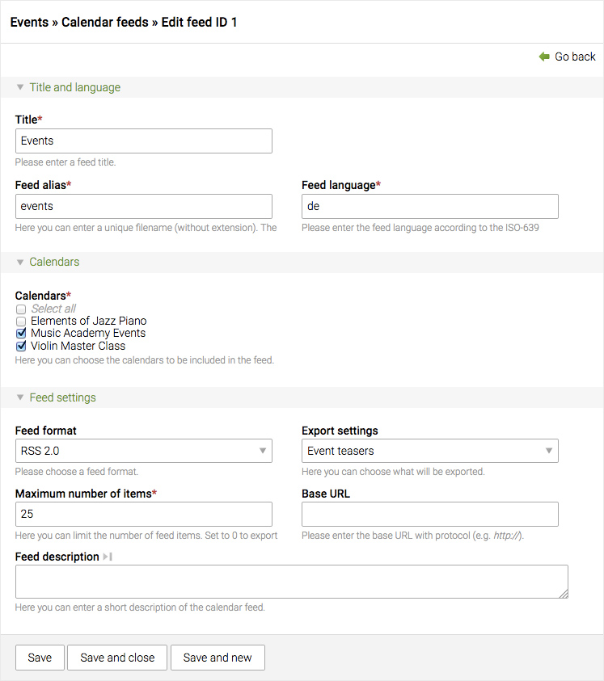

## RSS/Atom feed

This feature can be used for news archives and calendars. Here is an example
with the calendars list.




### Settings

One or several calendars can be grouped and exported as an RSS or Atom feed.
It goes the same for news archives. At the same time, you can choose to export
only the teasers or full articles of each event or news.




### XML files

The XML files are generated automatically in the ```share``` directory of your
Contao installation. In this example : ```share/events.xml```.
