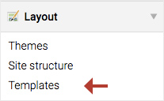

## Templates

A template is mainly composed of HTML and PHP code. It is used to structure a
piece of content of a module or a content element, etc. For example, the
template `news_full.html5` displays the full content of a news item whereas the
template `news_short.html5` displays only a portion of this content.

The templates are located in their own modules. For example, `news_full.html5`
is located under `system/modules/news/templates/news`.

If you edit this file directly in this folder, it will be overwritten the next
time you will update Contao and **you will lose** all your changes. To avoid
this, Contao allows you to modify the templates directly from the back end. In
this case, the file is duplicated and your changes will be preserved during
each update.



Create a new folder and add one or more templates you want to edit. Subsequently,
do not forget to attach the folder to the theme as explained in the paragraph
[Theme components][1].

A template can be a part of the structure of a module, a content element, a form,
etc. and that is why they are prefixed. They can be easily grouped, ordered and
recognized. For example: the prefix `j_` means "jQuery" and `nl_` means
"newsletter".


### Template inheritance

The inheritance allow you to create a template based on a second template. This
means that a template (child) inherits the content of a second template (parent).

In order that the content of a parent template may be modified or completed
in the child template, it must be surrounded by an element named `block`.

A block is built as follows:

```php
<?php $this->block('name_of_the_block'); ?>

  // Block content

<?php $this->endblock(); ?>
```

The example below shows a parent template with a block surrounding the
content of the `head` tag.

Template `fe_page.html5`:

```html
<!DOCTYPE html>
<html>
<head>
  <?php $this->block('head'); ?>
    <title><?php echo $this->title; ?></title>
    <link rel="stylesheet" href="style.css">
  <?php $this->endblock(); ?>
</head>
<body>
  ...
</body>
</html>
```

In the child template `fe_custom.html5`, a style sheet is added in the `head`
tag in addition to the inherited content of the parent template `fe_page.html5`.

Template `fe_custom.html5`:

```html
<?php $this->extend('fe_page'); ?>

<?php $this->block('head'); ?>
  <?php $this->parent(); ?>
  <link rel="stylesheet" href="style_2.css">
<?php $this->endblock(); ?>
```

* The `extend()` function specifies the template name whose it inherits the
content.
* The `parent()` function allows to complete a block without replacing the
inherited content.

The output of the `fe_custom.html5` template will be:

```html
<!DOCTYPE html>
<html>
<head>
  <title>A title</title>
  <link rel="stylesheet" href="style.css">
  <link rel="stylesheet" href="style_2.css">
</head>
<body>
  ...
</body>
</html>
```


### Template insertion

A template can be inserted into another template thanks to the `insert()`
function.

```php
<?php $this->insert('template_name'); ?>
```

The `insert()` function also accepts the assignment of variables as second 
parameter.

```php
<?php $this->insert('template_name', array('key'=>'value')); ?>
```

In the example below, we would like to insert the template
`image-copyright.html5` in the template `image.html5`.

The template `image.html5` contains an `img` tag and the `insert()` function.

Template `image.html5`:

```html
src; ?>" alt="<?php echo $this->alt; ?>" />
<?php $this->insert('image-copyright', array('name'=>'Donna Evans', 'license'=>'Creative Commons')); ?>
```

The template `image-copyright.html5` contains a `small` tag that will be inserted
below the `img` tag in the template `image.html5`. The variables `name` and
`license` will be replaced with the values determined in the `insert()` function.

Template `image-copyright.html5`:

```html
<small>Photograph by <?php echo $this->name; ?>, licensed under <?php echo $this->license; ?></small>
```

The output of the `image.html5` template will be:

```html

<small>Photograph by Donna Evans, licensed under Creative Commons</small>
```


[1]: ../03-managing-pages/themes.md#theme-components
