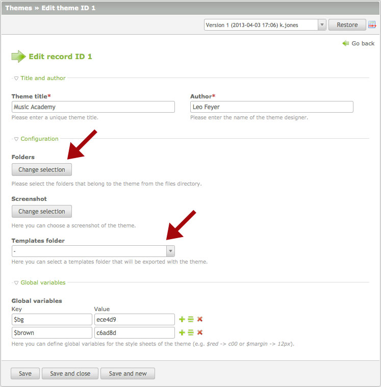

## Themes

A website design typically consists of style sheets, front end modules, page
layouts, files and templates, which you can manage in the Contao back end. The
theme manager does not change this approach at all, it just adds an option to
export and import those resources.

### Themes versus front end templates

The main difference between [themes][1] and front end templates is that a front
end template contains a fully preconfigured example website, including an
example site structure, articles, content elements and even users and groups. A
theme, in contrast, contains only the actual website design and can therefore be
imported without losing any existing data.

### Theme components

A theme is a group of [style sheets][2], [front end modules][3] and [page
layouts][4], which are all stored in the database and automatically recognized
by the theme exporter. You will learn more about those elements in the following
chapters. A theme typically also includes images and other files from the files
directory and optional custom templates from the templates directory. However,
those resources are not automatically linked with the theme and therefore have
to be added in the theme configuration to be included in the theme export.

### Theme export and import

To export a theme, simply click on the export button and download the .cto file
to your local computer. Although .cto is a proprietary file extension for Contao
themes, the file is actually a ZIP archive that can be extracted with every
program that handles .zip files. To reimport the theme, upload the .cto file to
your Contao installation, open the theme manager and click on "Theme import".
You can import multiple themes at once. After the import has been completed, you
can assign the page layout(s) of the new theme in the site structure.

[1]: https://contao.org/en/contao-themes-and-templates.html
[2]: ../04-managing-pages/style-sheets.md#style-sheets
[3]: ../04-managing-pages/modules.md#modules
[4]: ../04-managing-pages/page-layouts.md#page-layouts
