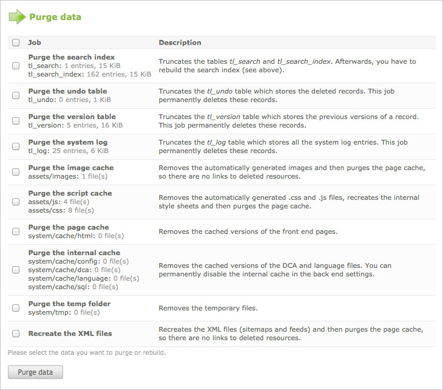

## Maintenance

Most of the maintenance jobs in Contao are executed automatically by the
Periodic Command Scheduler, so you can focus on your actual work. Even the tasks
in the maintenance module are carried out automatically, however sometimes it is
necessary to trigger them manually.

### Purging data

Besides the user generated content, Contao stores a lot of system data which is
used to restore deleted records, revert back to prior versions, search the
website or decrease the page loading time. You can purge this data manually e.g.
to remove old thumbnails from the image cache or to recreate the XML sitemap
files after you have modified the site structure.

### Rebuilding the search index

Pages are usually added to the search index automatically when they are viewed
in the front end (unless you are logged into the back end at the same time), so
you do not need to worry about the search index. However if you have changed a
large number of pages, it is more convenient to update them all at once instead
of opening them one by one in the browser. In this case you can rebuild the
search index manually.

