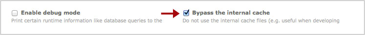

## Bypass the internal cache 

Before developing extensions for Contao, you should bypass the internal cache.
If you want to bypass the internal cache, navigate to "System" -> "Settings" and 
enable the checkbox "Bypass the internal cache" under "Global configuration".

As soon as the site goes into production, you should uncheck "Bypass the 
internal cache" in order to minimize the response time.  
