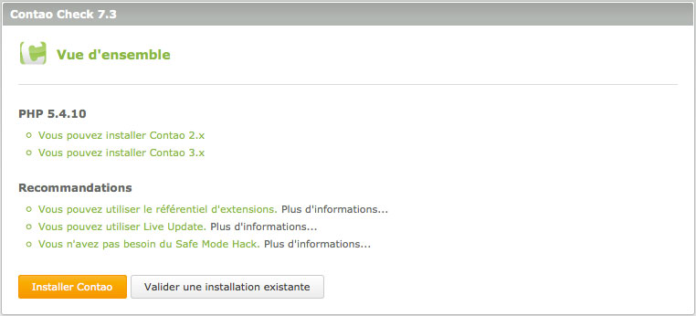

## Configuration du serveur en ligne

Ce chapitre ne traite pas sur la configuration d'un serveur en termes
d'installation d'Apache ou de compilation de PHP, que vous ne pouvez pas faire
sur un compte d'hébergement mutualisé de toute façon. Il explique comment
vérifier si les exigences du système de Contao sont remplies et comment
activer PHP 5.

### Configurations du système requises de Contao

Contao requiert un serveur web comme Apache ou IIS avec PHP et le support de
MySQL. La version minimum de PHP est 5.3.2 et la version minimale de MySQL est
5.0. Vous avez également besoin des extensions PHP "GDlib"
(redimensionnement d'image), "DOM" (fichiers XML), "SOAP" (référentiel
d'extensions) et éventuellement "mbstring" (gestion des caractères multi-octets)
ainsi que "mcrypt" (cryptage des données). Contao a été testé avec succès avec
tous les principaux navigateurs comme Firefox (à partir de la version 2) ou
Internet Explorer (à partir de la version 8).

### Contao Check

Télécharger "Contao Check" afin de savoir si votre serveur répond aux exigences
du système de Contao. Le script va vérifier si vous pouvez utiliser le
référentiel d'extensions ainsi que le "Live Update" et si vous devez utiliser le
"Safe Mode Hack" ou non. Selon la configuration de votre système, vous pouvez
mettre en place une nouvelle installation de Contao avec l'installateur web ou
valider une installation existante.

Extrayez le fichier Zip, téléversez le dossier `check` dans votre répertoire
d'installation de Contao et ouvrez-le dans un navigateur Web.

[Télécharger Contao Check][1] | [Ouvrir le projet sur GitHub][2]

### Paramètres FAI spécifiques

Il y a quelques grands fournisseurs d'accès à internet qui requièrent un peu de
configurations supplémentaires afin que Contao puisse fonctionner. Heureusement,
ils ne sont que l'exception qui confirme la règle. Les paramètres FAI
spécifiques sont décrites dans le [forum de Contao][3]. Si vous cherchez un
hébergement sans tracas pour Contao, consultez la liste des [hébergements
partenaires de Contao][4].

[1]: https://github.com/contao/check/zipball/master
[2]: https://github.com/contao/check
[3]: https://community.contao.org/en/
[4]: https://contao.org/en/partners.html?search=services&for=partner_hosting
