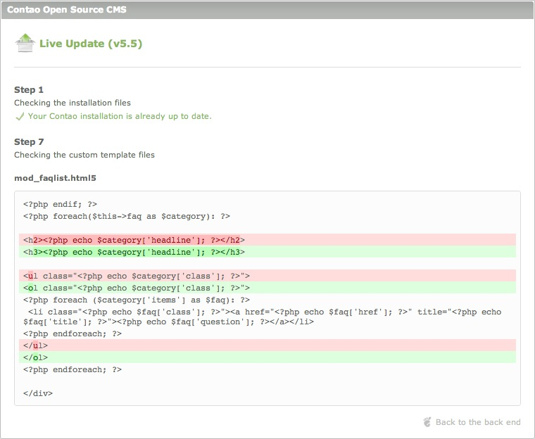

## Live Update Service

Le "Contao Live Update Service" est un service commercial proposé par [iNet
Robots][1], la compagnie du fondateur de Contao et développeur principal, Leo
Feyer. Il vous permet de mettre à jour votre installation en quelques clics à
partir du panneau d'administration, sans avoir à télécharger une archive de
Contao ou en utilisant un logiciel FTP pour remplacer ou synchroniser des
fichiers.

[S'inscrire pour obtenir un ID Live Update][2]

Le Live Update comprend les fonctionnalités suivantes:

* Mise à jour et retour à une version antérieure vers n'importe quelle version
de Contao
* Sauvegarde automatique de la base de données avant la mise à jour
* Validation personnalisée et achèvement de l'installation de Contao
* Comparaison des modèles personnalisés et des fichiers originaux

### Sélection d'une version

### Différences entre les modèles

### Résolution de problèmes

99% de tous les problèmes de mise à jour du Live Update sont causés par des
permissions de fichiers erronés. Contao requiert des autorisations d'écriture
pour gérer les fichiers et les dossiers, en conséquence si le Live Update ne
fonctionne pas correctement, vérifiez la configuration de votre serveur et
assurez-vous de mettre en place le Safe Mode Hack **tel que décrit dans ce mode
d'emploi** !

> #### info:: 
> Si vous rencontrez des problèmes pour activer votre ID Live Update ou pour
> recevoir l'archive de mise à jour, veuillez s'il vous plaît contacter le
> [support de iNet Robots][3]. Si vous rencontrez des problèmes pour configurer
> le "Safe Mode Hack" ou pour utiliser Contao, choisissez s'il vous plaît une
> option de support sur la [page de support][4].

[1]: http://www.inetrobots.com
[2]: https://update.contao.org/
[3]: https://update.contao.org/en/support.html
[4]: https://contao.org/en/support.html
