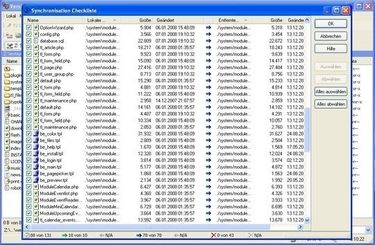

## Mise à jour manuelle

Pour mettre à jour manuellement une installation de Contao, vous pouvez soit
téléverser l'archive complète de Contao sur le serveur (remplacement des
fichiers) ou vous pouvez téléverser uniquement les fichiers qui ont été
modifiés depuis la dernière mise à jour (synchronisation des fichiers). De
toute façon, vous devriez toujours sauvegarder les fichiers et dossiers
ci-dessous juste au cas où il y aurait une erreur ou lors d'un remplacement
accidentel :

* `files/*`
* `system/config/dcaconfig.php`
* `system/config/initconfig.php`
* `system/config/langconfig.php`
* `system/config/localconfig.php`
* `templates/*`

Cela permettra de sauvegarder votre configuration locale, vos modèles
personnalisés et vos fichiers.

### Remplacement de fichiers

Le remplacement des fichiers d'une installation de Contao est assez simple. Il
suffit de décompresser l'archive de Contao sur le serveur ou de l'extraire sur
votre ordinateur et de téléverser les fichiers avec un client FTP. Puis,
restaurer les fichiers que vous avez sauvegardés et enlever les éventuels
fichiers inutilisés des versions antérieures de Contao.

> #### warning:: Attention
> Si vous avez installé des extensions tierces, assurez-vous de
> les sauvegarder et de les restaurer eux aussi, ou ne les effacer pas du tout.
> Sinon, vous devrez réinstaller les modules et, en fonction de l'extension,
> vous pourriez finir par perdre des données !

### Synchronisation de fichiers

Pour synchroniser une installation de Contao, vous pouvez soit utiliser
l'[utilitaire Unix diff][1] ou un logiciel FTP. Les utilitaires Unix sont
généralement utilisés par les administrateurs de serveurs uniquement et, par
conséquent, ils ne seront pas expliqués ici. Pour synchroniser des fichiers via
FTP, ouvrez WinSCP et connectez-vous au serveur. Sauvegardez les fichiers
mentionnés ci-dessus, puis accédez au répertoire de Contao et cliquez sur le
bouton "Synchroniser les fichiers".

Contrôlez les options attentivement et assurez-vous de choisir "Preview changes"
pour que vous puissiez contrôler quels fichiers seront mis à jour. Ensuite
confirmez chaque fichier dans la fenêtre d'aperçu et contrôlez spécialement les
fichiers qui vont être effacés ! Cliquez sur OK pour démarrer le processus de
synchronisation.

### Mise à jour de la base de données

Après avoir mis à jour les fichiers de Contao, vous devez également mettre à jour
la base de données. Heureusement, l'outil d'installation de Contao effectuera le
gros du travail pour vous. Il suffit de l'ouvrir et de saisir votre mot de passe,
puis faites défiler la page vers le bas jusqu'à la section base de données et
confirmez les modifications.

### Purger le cache interne

Finalement, vous devez également reconstruire le cache interne (pour les DCA et
les fichiers de langue). Dans le back office, allez à "Maintenance du système"
et cochez "Purger le cache interne" dans la section "Nettoyer les données".
Confirmez l'action en cliquant sur "Nettoyer les données".

Vous recevrez un message dans l'en-tête demandant de reconstruire le cache
interne. Cliquez sur "Construire le cache" pour mettre en cache les fichiers
internes.

[1]: http://fr.wikipedia.org/wiki/Diff
