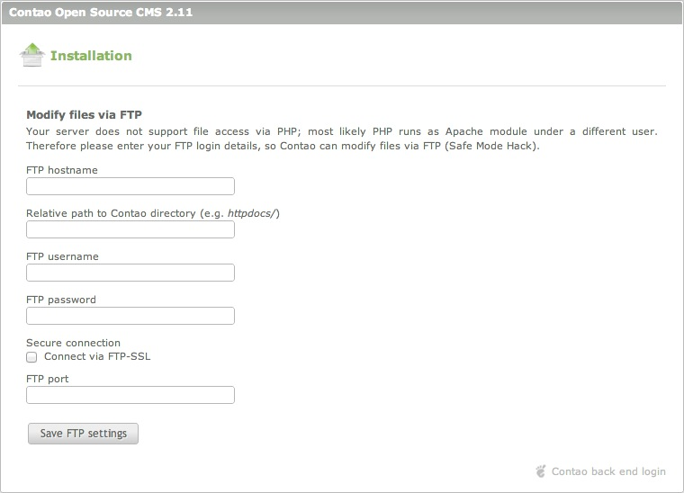

## Utilisation du Safe Mode Hack

En essayant d'installer Contao avec l'outil d'installation, vous pourriez voir
un avertissement que le fichier de configuration local n'est pas accessible en
écriture.

### Problèmes d'autorisation de fichiers

Le terme "Safe Mode Hack" peut prêter à confusion, car il implique que le
problème a été causé par le `safe_mode` de PHP. Cependant, il est causé par des
permissions de fichiers insuffisantes et peut se produire même si le `safe_mode`
est désactivé, il devrait donc être appelé "File Permission Hack" à la place.
PHP en tant que module Apache est généralement exécuté comme `wwwrun`, `www-data`
ou `nobody`, alors que les fichiers que vous téléverser via FTP vous
appartiennent (par exemple `web4` ou `ab5678`). Le serveur refuse donc, au
script PHP de Contao, l'accès à ces fichiers.

#### Utilisation du FTP pour les opérations sur les fichiers

Pour contourner le problème des permissions, Contao établit une connexion FTP
pour modifier les fichiers et les répertoires. Tout ce que vous avez à faire est
d'entrer vos identifiants de connexion FTP. Faites attention lorsque vous entrez
le chemin relatif à partir de votre répertoire racine FTP vers le répertoire de
Contao (par exemple `html/`, `public_html/` ou `httpdocs/`).

Quelques répertoires nécessitent encore des autorisations d'écriture, car PHP va
y accéder directement :

* `assets/images`
* `assets/images/*`
* `system/logs`
* `system/tmp`

Les permissions (CHMOD 777) sont fixées automatiquement par l'outil
d'installation et n'ont normalement pas à être ajustées manuellement. Si cela
est nécessaire, veuillez, s'il vous plaît, **seulement n'ajuster que les trois
répertoires mentionnés ci-dessus** - et cela en dépit de ce que vous pourriez
avoir lu dans un tutoriel ou dans les forums de Contao !
