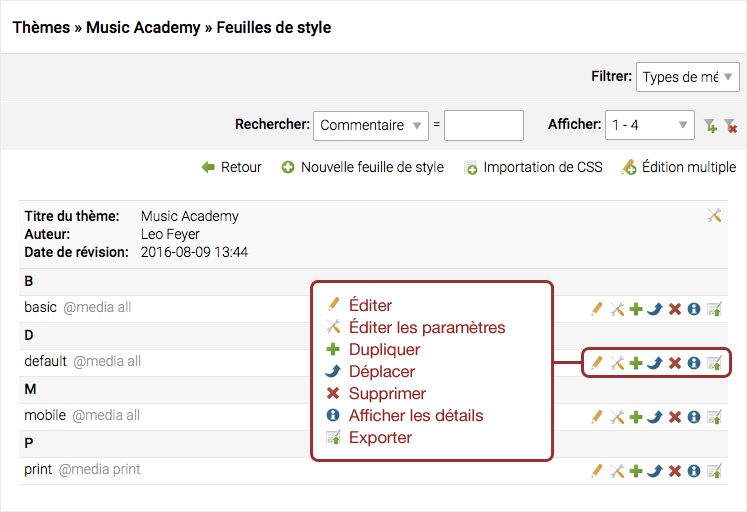
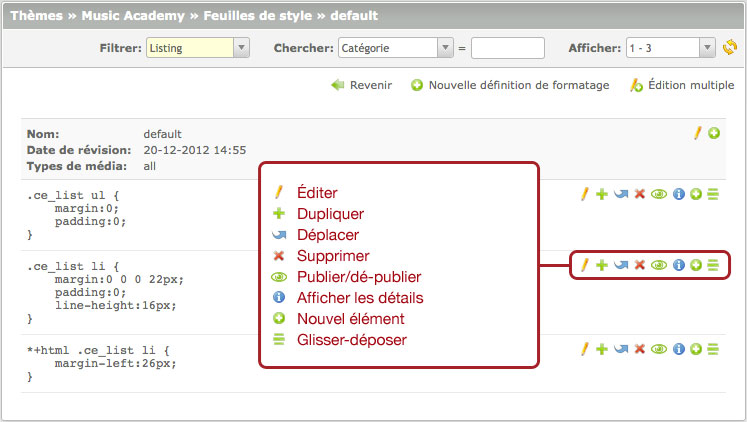
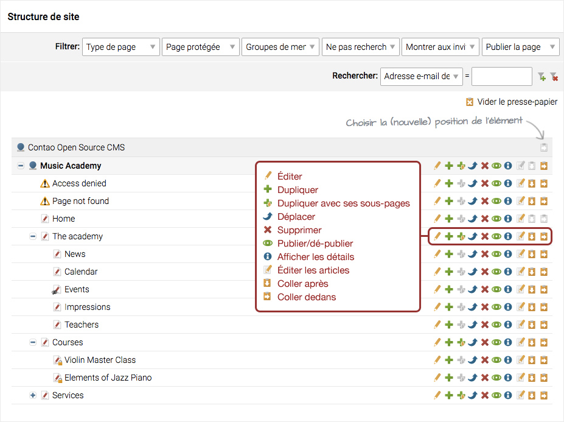
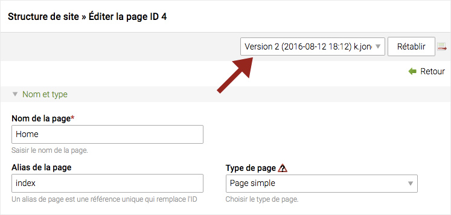
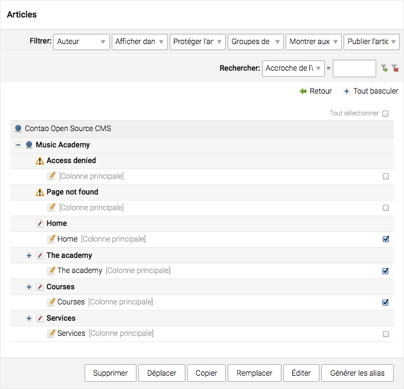
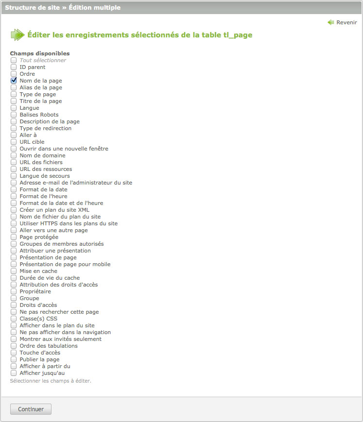
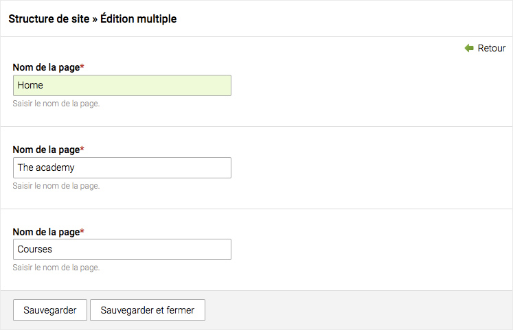

## Édition des enregistrements

L'édition des données est l'une des fonctions centrales d'un système de gestion 
de contenu. Contao offre beaucoup de fonctionnalités professionnelles qui 
rendent le processus d'édition aussi facile et confortable que possible. Vous 
pouvez revenir à des versions antérieures d'un enregistrement, restaurer des 
enregistrements supprimés, déplacer des enregistrements via le presse-papiers et 
même éditer plusieurs enregistrements à la fois. La plupart de ces fonctions 
sont accessibles en utilisant les icônes de navigation.

### Icônes de la vue en liste

La "vue en liste", étant la plus simple, ne propose que quatre actions de base : 
éditer, dupliquer, supprimer et afficher les détails.

### Icônes de la vue parente

La "vue parente" propose deux icônes de navigation supplémentaires pour contrôler 
l'ordre des enregistrements. L'ordre peut être modifié par glisser-déposer. Pour 
ce faire, cliquez simplement sur l'icône de navigation "Glisser-déposer" et 
faites-le glisser vers sa nouvelle position.

### Icônes de la vue arborescente

La "vue arborescente" nécessite des icônes supplémentaires pour gérer la 
structure hiérarchique. Outre la duplication d'un enregistrement unique, il 
prend en charge la duplication d'un enregistrement avec tous ses 
sous-enregistrements ainsi que la fonction "coller après" ou "coller dedans" un 
autre enregistrement, vous pouvez donc créer une structure imbriquée.

### Restaurer les versions précédentes

Contao crée automatiquement les nouvelles versions d'un enregistrement chaque 
fois que vous le sauvegarder. Dès qu'il existe plus d'une version, un menu 
déroulant, qui vous permet de revenir à une version antérieure, apparaît en haut 
du formulaire. Choisissez simplement une version et cliquez sur le bouton 
"Restaurer".

L'icône située à droite du bouton "Restaurer" vous permet de voir les 
différences entre deux versions.

### Édition de plusieurs enregistrements

La possibilité de modifier plusieurs enregistrements à la fois permet à Contao 
de clairement se démarquer de la variété des systèmes de gestion de contenu. 
Cliquez sur le bouton "Édition multiple" afin de changer le mode d'édition, puis 
sélectionnez un ou plusieurs enregistrements et choisissez les champs que vous 
souhaitez modifier.

