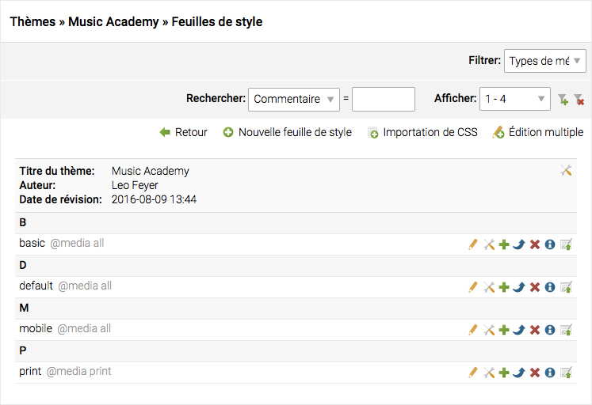
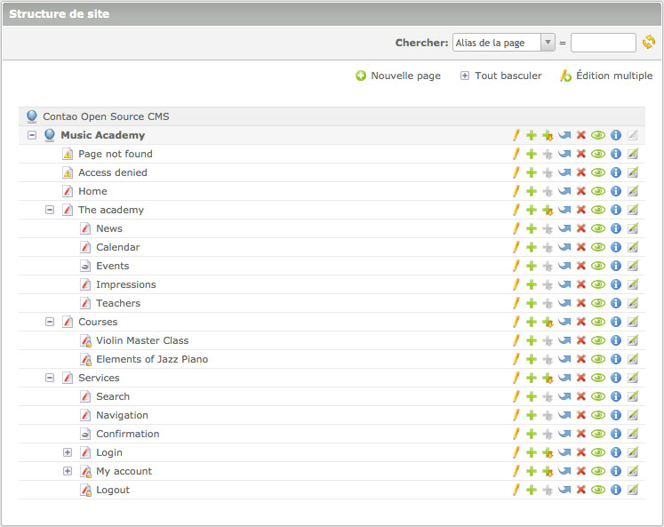
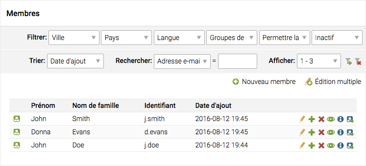

## Liste d'enregistrements

Contao supporte trois vues: une simple liste ("vue en liste"), une liste qui est
regroupée par sa table parente ("vue parente") et une liste hiérarchique ("vue
arborescente"). Ces trois vues peuvent être utilisées pour lister des
enregistrements de n'importe quelle table ou des tables liées entre elles.

### Vue en liste

La "vue en liste" répertorie les enregistrements d'une table unique dans un
ordre particulier. Les résultats sont généralement regroupés par leur première
lettre.

### Vue parente

La "vue parente" répertorie les enregistrements d'une table enfant qui sont liés
à un enregistrement particulier d'une table parente. Les relations de type
parent-enfant sont beaucoup utilisées dans Contao. Par exemple, pour les
articles et les éléments de contenu, les archives d'actualités et les actualités
ou les feuilles de style et les définitions de formatage.

### Vue arborescente

La "vue arborescente" liste des enregistrements et d'autres ressources tels
que des fichiers et des répertoires qui sont organisés dans une structure
hiérarchique. Contao prend en charge les relations hiérarchiques au sein d'une
table (par exemple, la structure de site) ainsi que des tables enfants qui se
rapportent aux tables hiérarchiques parentes (par exemple, les articles et les
pages).

### Tri et filtrage des données

Contao supporte différentes façons d'affiner les résultats de sorte que vous ne
lâchiez pas le fil même si une table possède plusieurs milliers de lignes. Un
grand nombre d'entrées peuvent être filtrées par un ou plusieurs champs de sorte
qu'ils ne montrent que les enregistrements correspondant aux critères de
filtrage. La plupart des entrées offrent de plus une recherche en texte intégral
qui prend même en charge les expressions régulières. Afin de réduire le temps de
chargement de la page au minimum, Contao affiche seulement trente
enregistrements à la fois.

