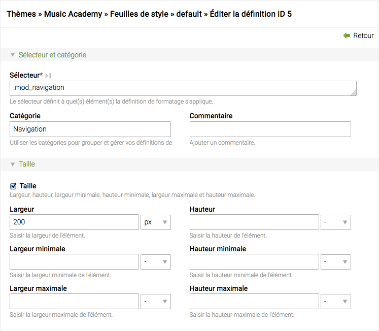

## Feuilles de style

Les sites internet accessibles doivent toujours être formatés à l'aide des CSS,
c'est pourquoi Contao inclut un module "feuilles de style" qui vous permet de
gérer les définitions de formatage dans le back office. Pour référencer les
différents éléments de Contao, vous devez connaître leurs noms de classe. Les
[classes des éléments de contenu][1] commencent par "ce\_" (par exemple
"ce\_text") et les [classes des modules][2] avec "mod\_"
(par exemple "mod\_search"). Si vous n'êtes pas sûr, il suffit de
regarder dans le code source de la page.



Chaque feuille de style peut être limitée par un ou plusieurs types de média
et/ou par une version particulière d'Internet Explorer, dans le cas où vous avez
besoin de fixer un de ses nombreux bogues. Faites attention à l'ordre des
définitions de formatage, car celles qui suivent, remplacent les précédentes.


### Classes CSS des éléments inclus

Si un élément est inclus dans un autre élément, les classes CSS sont fusionnées
au lieu d'être surchargées. Par exemple, si l'élément de contenu A a la classe
CSS `elemA` et inclut un module front office avec la classe CSS `elemB`, les
deux classes CSS seront appliquées (`class="elemA elemB"`).

Voici comment sélectionner les éléments séparément :

```CSS
.elemA {
    /* Élément de contenu seulement */
}

.elemB {
    /* Élément de contenu et module front office */
}

.elemB:not(.elemA) {
    /* Module front office seulement */
}
```


[1]: ../04-gestion-du-contenu/articles.md#articles
[2]: ../03-gestion-des-pages/modules.md#modules
