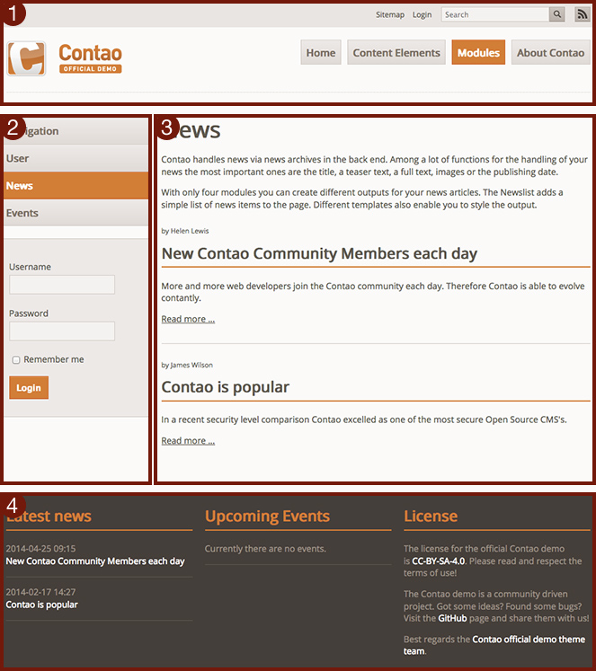

## Présentations de page

Les présentations de page déterminent l'agencement basique d'une page, par ex.
le nombre de colonnes ou la largeur générale, et elle définissent quels
[modules front office][1] vont être affichés dans quelles colonnes. Elles
permettent aussi d'inclure des feuilles de style, de lier la page à un flux RSS
ou Atom, d'associer un ID Google Analytics et d'ajouter du code JavaScript qui
pourrait être requis pour contrôler des éléments interactifs ou des plugins. Le
framework CSS de Contao divise automatiquement la fenêtre du navigateur en
plusieurs sections et affiche les modules qui ont été assignés à ces sections
les uns à la suite des autres.

L'exemple ci-dessous montre une mise en page divisée en quatre sections :

1. un en-tête (`#header`)
2. une barre latérale "sidebar" (`#left`)
3. une section principale (`#main`)
4. un pied de page (`#footer`)

Les modules sont ajoutés dans chaque section grâce à la présentation de page :

Cela implique que lorsque vous allez créer une présentation de page, vous devriez
déjà avoir créé toutes les feuilles de style et les modules front office que vous
voulez inclure. C'est pourquoi, il est recommandé de créer les ressources dans
l'ordre suivant :

* Créer les modules front office nécessaires
* Créer les feuilles de style nécessaires
* Optionnellement, créer des archives d'actualités ou des calendriers
* Créer une présentation de page et combiner tous les composants

[1]: ../03-gestion-des-pages/modules.md
