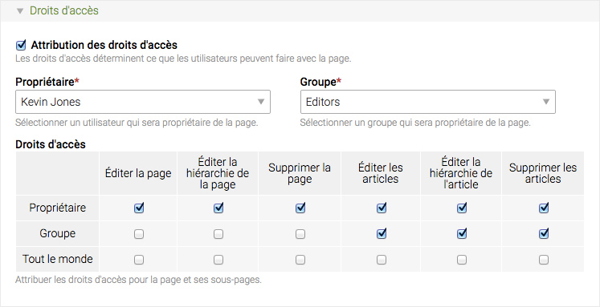

## Types de page

Le type de page détermine si la page va afficher du contenu, rediriger vers une 
autre page ou définir le point de départ d'un nouveau site internet dans la 
structure de page. Contao supporte six types de pages différents qui sont 
expliqués ci-dessous. 

<table>
<tr>
  <th>Type de page</th>
  <th>Description</th>
</tr>
<tr>
  <td>Page simple</td>
  <td>Une page simple contient des articles et des éléments de contenu. C'est 
  le type de page par défaut.</td>
</tr>
<tr>
  <td>Rediriger vers une URL externe</td>
  <td>Ce type de page réoriente automatiquement les visiteurs vers une URL 
  externe. Cela fonctionne comme un lien hypertexte.</td>
</tr>
<tr>
  <td>Rediriger vers une autre page du site</td>
  <td>Ce type de page réoriente automatiquement les visiteurs vers une autre 
  page de la structure de site.</td>
</tr>
<tr>
  <td>Racine d'un nouveau site</td>
  <td>Ce type de page est le point de départ pour créer un site internet dans 
  la structure de site.</td>
</tr>
<tr>
  <td>Erreur 403 (accès interdit)</td>
  <td>Si un utilisateur sans permission essaye d'accéder à une page protégée, 
  une page d'erreur 403 sera retournée. Cette page doit être ajoutée <b>au 
  premier niveau</b> dans votre page racine d'un nouveau site.</td>
</tr>
<tr>
  <td>Erreur 404 (page non trouvée)</td>
  <td>Si un utilisateur essaye d'accéder à une page qui n'existe pas, une page 
  d'erreur 404 sera retournée. Cette page doit être ajoutée <b>au premier 
  niveau</b> dans votre page racine d'un nouveau site.</td>
</tr>
</table>

### Mode multi-domaines

Contao supporte plusieurs sites internet à l'intérieur de la structure de site 
et redirige automatiquement les visiteurs vers une racine de site particulière 
en fonction du nom de domaine ou des réglages de langues. Imaginons par exemple 
que vous deviez créer un site d'entreprise bilingue qui utilise le nom de 
domaine "www.example.com" et un petit site personnel qui utilise le nom de 
domaine "www.personal.example.org". Vous aurez besoin de trois pages racines 
d'un nouveau site pour cela : 

<table>
<tr>
  <th>Type</th>
  <th>DNS</th>
  <th>Code de langue</th>
  <th>Langue de secours</th>
</tr>
<tr>
  <td>Site internet d'entreprise en Allemand</td>
  <td>aucun</td>
  <td>de</td>
  <td>non</td>
</tr>
<tr>
  <td>Site internet d'entreprise en Anglais</td>
  <td>aucun</td>
  <td>en</td>
  <td>oui</td>
</tr>
<tr>
  <td>Site internet personnel</td>
  <td>www.personal.example.org</td>
  <td>de</td>
  <td>oui</td>
</tr>
</table>

Le tableau suivant montre vers quelle page un visiteur va être redirigé en 
fonction du nom de domaine et de la langue de son navigateur.

<table>
<tr>
  <th>Domaine</th>
  <th>Langue du navigateur</th>
  <th>Cible de redirection</th>
</tr>
<tr>
  <td>www.example.com</td>
  <td>Anglais</td>
  <td>Site internet d'entreprise en Anglais</td>
</tr>
<tr>
  <td>www.example.com</td>
  <td>Allemand</td>
  <td>Site internet d'entreprise en Allemand</td>
</tr>
<tr>
  <td>www.example.com</td>
  <td>Espagnol</td>
  <td>Site internet d'entreprise en Anglais</td>
</tr>
<tr>
  <td>www.personal.example.org</td>
  <td>Non pertinent</td>
  <td>Site internet personnel</td>
</tr>
</table>

Notez que si nous n'utilisions pas l'option "langue de secours", le site internet 
personnel ne serait disponible que pour les utilisateurs dont la langue du 
navigateur est l'Allemand ! 

### Droits d'accès

Les droits d'accès déterminent ce que les utilisateurs du back office sont 
autorisés à faire avec une page et ses articles. Ils n'ont rien à voir avec les 
pages protégées qui ne sont accessibles que par certains utilisateurs front 
office ! Similaire au système de permissions des fichiers Unix, il existe trois 
niveaux d'autorisation :

* Accès en tant que propriétaire d'une page
* Accès en tant que membre d'un groupe propriétaire de la page
* Accès en tant qu'utilisateur sans privilège

Chaque niveau peut avoir différentes permissions. Par défaut, le propriétaire de 
la page est autorisé à éditer la page elle-même ainsi que les articles de la 
page, tandis qu'un utilisateur d'un groupe qui possède une page est autorisé à 
éditer les articles seulement. Les utilisateurs sans privilège n'ont aucun droits 
en écriture.

