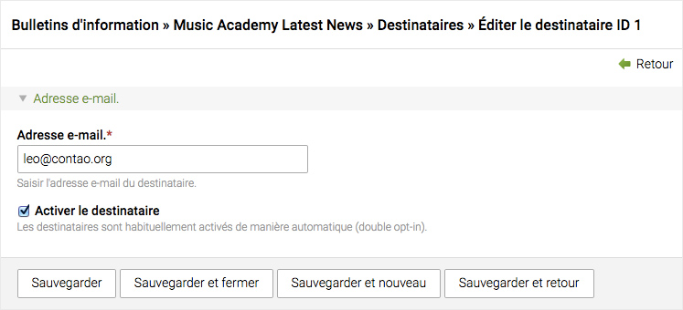
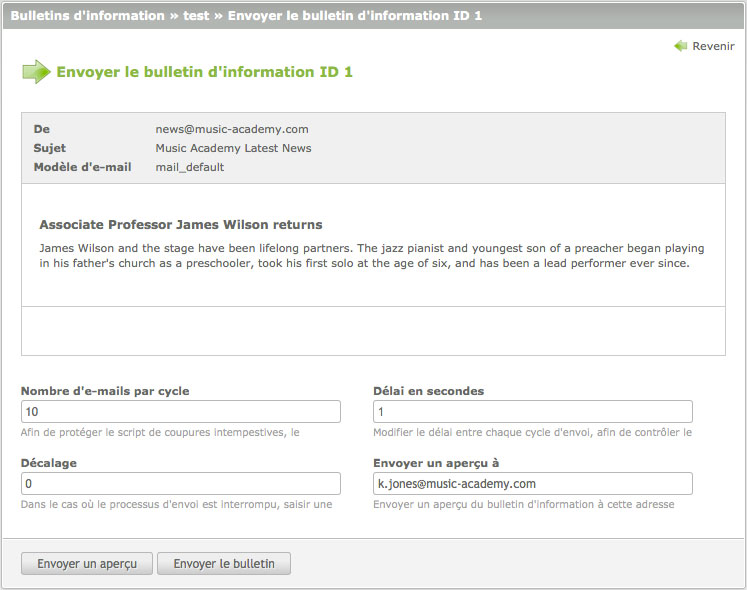

## Bulletins d'information

L'extension bulletins d'information vous permet de gérer et d'envoyer des
bulletins d'information et optionnellement de les afficher sur le site
internet. Contrairement aux articles qui sont associés à une page particulière,
les bulletins d'information sont organisés en listes de diffusion, ce qui vous
permet de facilement les regrouper ou de les catégoriser.


### Destinataires

Les inscriptions à un bulletin d'information sont traitées par les modules front
office créés à cet effet, donc vous n'avez pas à gérer les destinataires
manuellement. Pour des raisons de protection des données privées, Contao utilise
l'inscription par [Double Opt In][1] et ne stocke que l'adresse e-mail de
l'abonné.



Au cas où vous auriez déjà une liste de destinataires, vous pouvez l'importer
dans Contao à partir d'un fichier CSV.


### Bulletins d'information personnalisés

Dans la mesure où vous envoyez des bulletins d'information à des membres
inscrits, vous pouvez personnaliser ces bulletins avec des "Simple Tokens".
Les "Simple Tokens" fonctionnent d'une manière similaire à celle des [balises
d'insertion][2] et peuvent être utilisés aussi bien dans la version HTML que
dans la version texte de votre bulletin d'information.

```
Cher ##firstname## ##lastname##,

Veuillez mettre à jour vos données personnelles :

Rue:         ##street##
Code postal: ##postal##
Ville:       ##city##
Téléphone:   ##phone##
E-mail:      ##email##

L'administrateur
```

Cependant, contrairement aux balises d'insertion, les "Simple Tokens" ne
permettent pas seulement d'ajouter des données de la table `tl_member`, mais
aussi de faire des déclarations if-else simples, par ex. de spécifier une
salutation :

```
{if gender=="male"}
Monsieur ##lastname##,
{elseif gender=="female"}
Madame ##lastname##,
{else}
Madame, Monsieur,
{endif}

[contenu du bulletin]

{if phone==""}
Veuillez s'il vous plaît mettre à jour vos informations de contact et entrer
votre numéro de téléphone.
{endif}

L'administrateur
```


### Envoyer des bulletins d'information

En particulier sur les hébergements mutualisés, il y a des limites concernant
le temps d'exécution d'un script et/ou le nombre d'e-mails qui peuvent être
envoyés par minute. Contao essaie de contourner ces deux problèmes en divisant
le processus d'envoi en plusieurs cycles pour éviter le dépassement du temps
d'exécution du script et en ajoutant une pause entre chaque cycle pour
contrôler le nombre d'e-mails par minute.




### Modules front office

Les modules front office sont utilisés pour gérer les inscriptions aux
bulletins d'information et optionnellement les afficher sur le site internet.
Ils peuvent être configurés avec le module "Modules" dans le back office et
doivent être ajoutés à un article ou à une présentation de page pour être
affichés sur le site internet.

<table>
<tr>
  <th>Module</th>
  <th>Classe CSS</th>
  <th>Description</th>
</tr>
<tr>
  <td>S'abonner</td>
  <td>mod_subscribe</td>
  <td>Génère un formulaire pour s'abonner à une ou plusieurs listes de
  diffusion.</td>
</tr>
<tr>
  <td>Se désabonner</td>
  <td>mod_unsubscribe</td>
  <td>Génère un formulaire pour se désabonner à une ou plusieurs listes de
  diffusion.</td>
</tr>
<tr>
  <td>Liste de bulletins d'information</td>
  <td>mod_nl_list</td>
  <td>Ajoute une liste de bulletins d'information à une page.</td>
</tr>
<tr>
  <td>Lecteur de bulletins d'information</td>
  <td>mod_nl_reader</td>
  <td>Affiche les détails d'un bulletin d'information.</td>
</tr>
</table>


### Permaliens

Chaque bulletin d'information a une URL unique (permalien) qui peut être
utilisée pour le référencer :

```
http://www.example.com/newsletters/items/james-wilson-returns.html
```

L'URL ci-dessus sollicite le bulletin d'information "james-wilson-returns" via
la page "newsletters". Rappelez-vous que Contao est un CMS basé sur les pages,
donc si la page "newsletters" n'existait pas ou si elle n'incluait pas le
module lecteur de bulletins d'information, alors le bulletin d'information ne
serait pas affiché.


[1]: http://fr.wikipedia.org/wiki/Opt_in
[2]: ../04-gestion-du-contenu/balises-insertion.md#balises-d-insertion
