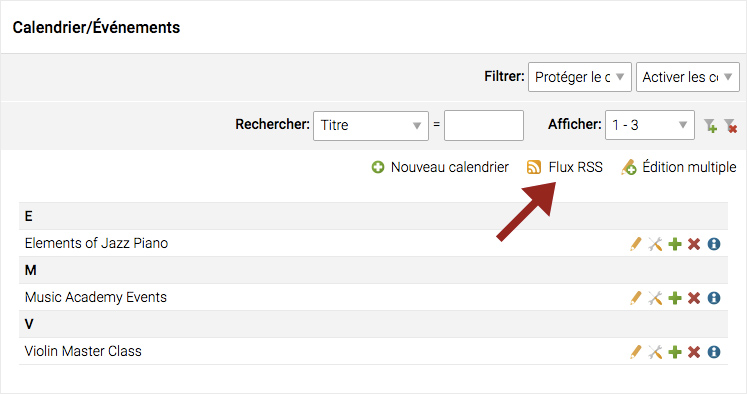
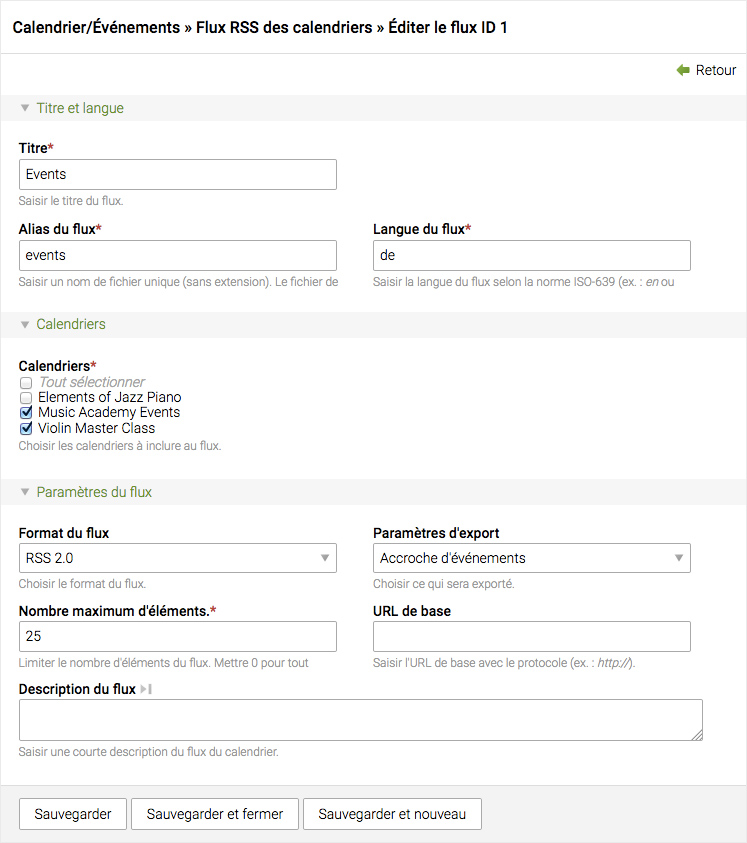

## Flux RSS/Atom

Cette fonctionnalité peut être utilisée pour les archives d'actualités et les 
calendriers. Voici un exemple avec la liste des calendriers.




### Paramètres

Un ou plusieurs calendriers peuvent être regroupés et exportés en tant que flux 
RSS ou Atom. Il en va de même pour les archives d'actualités. Dans un même 
temps, vous pouvez choisir d'exporter uniquement les accroches ou les articles 
complets de chaque événement ou actualité.




### Fichiers XML

Les fichiers XML sont générés automatiquement dans le répertoire ```share``` 
de votre installation de Contao. Dans cet exemple : ```share/events.xml```.
