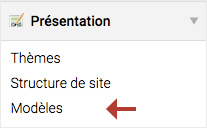

## Modèles

Un modèle est principalement composé de codes HTML et PHP. Il est utilisé pour
structurer une partie du contenu d'un module ou d'un élément de contenu, etc.
Par exemple, le modèle `news_full.html5` affiche le contenu complet d'une
actualité alors que le modèle `news_short.html5` affiche seulement une partie
de ce contenu.

Les modèles se trouvent dans leurs propres modules. Par exemple,
`news_full.html5` se trouve sous
`vendor/contao/news-bundle/src/Resources/contao/templates/news`.

Si vous modifiez ce fichier directement dans ce dossier, il sera remplacé la
prochaine fois que vous mettrez à jour Contao et **vous perdrez** toutes vos
modifications. Pour éviter cela, Contao vous permet de modifier les modèles
directement à partir du back office. Dans ce cas, le fichier est dupliqué et vos
modifications seront conservées lors de chaque mise à jour.



Créez un nouveau dossier et ajoutez-y un ou plusieurs modèles que vous souhaitez
modifier. Par la suite, n'oubliez pas de joindre le dossier au thème comme
expliqué dans le paragraphe [Composants d'un thème][1].

Un modèle peut être une partie de la structure d'un module, d'un élément de
contenu, d'un formulaire, etc. et c'est pourquoi ils sont préfixés. Ils peuvent
être facilement groupés, classés et reconnus. Par exemple : le préfixe `j_`
signifie "jQuery" et `nl_` signifie "newsletter".


### Héritage de modèles

L'héritage vous permet de créer un modèle basé sur un second modèle. Cela
signifie qu'un modèle (enfant) hérite du contenu d'un second modèle (parent).

Afin que le contenu d'un modèle parent puisse être modifié ou complété
dans le modèle enfant, il doit être entouré d'un élément nommé `block`.

Un bloc est construit de la manière suivante :

```php
<?php $this->block('nom_du_bloc'); ?>

  // Contenu du bloc

<?php $this->endblock(); ?>
```

L'exemple ci-dessous montre un modèle parent avec un bloc entourant le
contenu de la balise `head`.

Modèle `fe_page.html5` :

```html
<!DOCTYPE html>
<html>
<head>
  <?php $this->block('head'); ?>
    <title><?php echo $this->title; ?></title>
    <link rel="stylesheet" href="style.css">
  <?php $this->endblock(); ?>
</head>
<body>
  ...
</body>
</html>
```

Dans le modèle enfant `fe_custom.html5`, une feuille de style est ajoutée dans
la balise `head` en plus du contenu hérité du modèle parent `fe_page.html5`.

Modèle `fe_custom.html5` :

```html
<?php $this->extend('fe_page'); ?>

<?php $this->block('head'); ?>
  <?php $this->parent(); ?>
  <link rel="stylesheet" href="style_2.css">
<?php $this->endblock(); ?>
```

* La fonction `extend()` spécifie le nom du modèle dont il hérite le
contenu.
* La fonction `parent()` permet de compléter un bloc sans remplacer le contenu
hérité.

Le résultat en sortie du modèle `fe_custom.html5` sera :

```html
<!DOCTYPE html>
<html>
<head>
  <title>A title</title>
  <link rel="stylesheet" href="style.css">
  <link rel="stylesheet" href="style_2.css">
</head>
<body>
  ...
</body>
</html>
```


### Insertion de modèles

Un modèle peut être inséré dans un autre modèle grâce à la fonction
`insert()`.

```php
<?php $this->insert('nom_du_modele'); ?>
```

La fonction `insert()` accepte également l'assignation de variables comme
second paramètre :

```php
<?php $this->insert('nom_du_modele', array('key'=>'value')); ?>

// Ceci passe toutes les variables à partir du modèle courant
<?php $this->insert('nom_du_modele', $this->getData()); ?>
```

Dans l'exemple ci-dessous, nous aimerions insérer le modèle
`image-copyright.html5` dans le modèle `image.html5`.

Le modèle `image.html5` contient une balise `img` et la fonction `insert()`.

Modèle `image.html5` :

```html
src; ?>" alt="<?php echo $this->alt; ?>" />
<?php $this->insert('image-copyright', array('name'=>'Donna Evans', 'license'=>'Creative Commons')); ?>
```

Le modèle `image-copyright.html5` contient une balise `small` qui sera insérée
en-dessous de la balise `img` dans le modèle `image.html5`. Les variables `name`
et `license` seront remplacées par les valeurs déterminées dans la fonction
`insert()`.

Modèle `image-copyright.html5` :

```html
<small>Photographie par <?php echo $this->name; ?>, sous licence <?php echo $this->license; ?></small>
```

Le résultat en sortie du modèle `image.html5` sera :

```html

<small>Photographie par Donna Evans, sous licence Creative Commons</small>
```


[1]: ../03-gestion-des-pages/themes.md#composants-dun-th%C3%A8me
