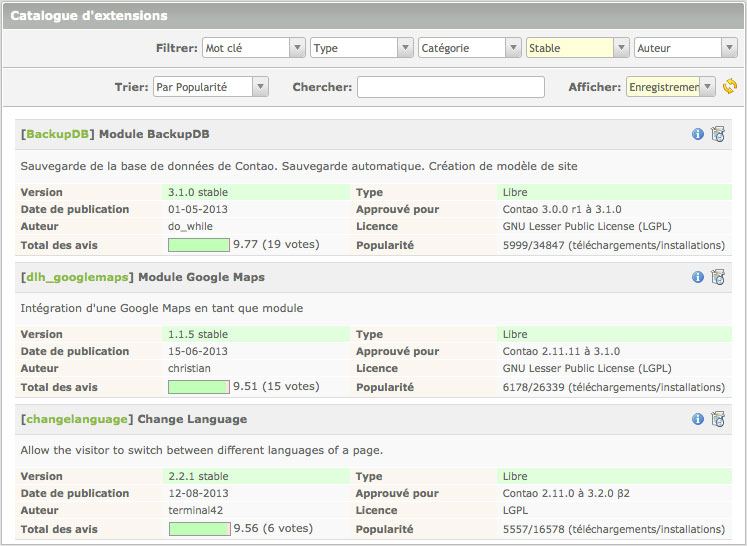

## Extensions

Les extensions sont une partie essentielle de Contao, car ils vous permettent
d'ajouter des fonctionnalités supplémentaires. Il existe plus de 1400 extensions
disponibles dans le référentiel d'extensions de Contao, que vous pouvez parcourir
directement à partir du back office. La communication avec le serveur du
référentiel s'effectue via SOAP, donc vous devez activer l'extension SOAP de PHP
pour utiliser le service (si elle n'est pas activée par défaut).

### Catalogue d'extensions

Le module "Catalogue d'extensions" vous permet de parcourir la liste des
extensions et d'installer des extensions par simple pression d'un bouton.
Utilisez les options de filtrage et de tri pour trouver une extension
particulière et cliquez sur l'icône d'information ou le titre de l'extension
pour ouvrir la page de détails et installer le module.

La page de détails contient une description de l'extension et des informations
importantes concernant les configurations du système requises ainsi que les
versions et les dépendances d'autres modules. Cliquez sur le bouton "Installer"
pour télécharger et installer l'extension.

Contao téléchargera et installera automatiquement l'extension et mettra à jour
la base de données si nécessaire.

### Gestionnaire d'extensions

Le module "Gestionnaire d'extensions" vous permet de mettre à jour et de
désinstaller des extensions. Il vérifie automatiquement les mises à jour et
vous avertit si une nouvelle version est disponible. De nombreuses extensions
incluent également des liens vers un manuel en ligne et/ou un fil de discussion
dans un forum où vous pouvez obtenir de l'aide.

Pour désinstaller une extension, cliquez simplement sur l'icône de
désinstallation et suivez les instructions. Le gestionnaire d'extensions va
supprimer tous les fichiers et répertoires et mettre à jour la base de données
si nécessaire. Notez que cette action ne peut pas être annulée et les tables ne
peuvent pas être restaurées !

### Installation manuelle

Dans le cas où l'extension SOAP de PHP n'est pas disponible sur votre serveur,
vous pouvez également installer des extensions de Contao manuellement. Trouvez
le module correspondant dans la [liste des extensions][1] et téléchargez
l'archive .zip de la dernière version. Ensuite, décompressez les fichiers et
copiez-les dans votre répertoire local ou distant de Contao. Enfin, vérifiez
la base de données avec l'[outil d'installation de Contao][2].

[1]: https://contao.org/en/extension-list.html
[2]: ../01-installation/installer-contao.md#l-outil-d-installation-de-contao
