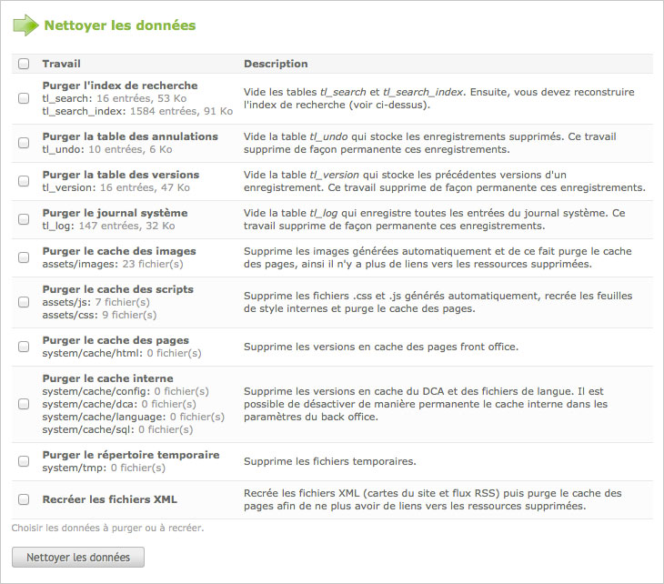
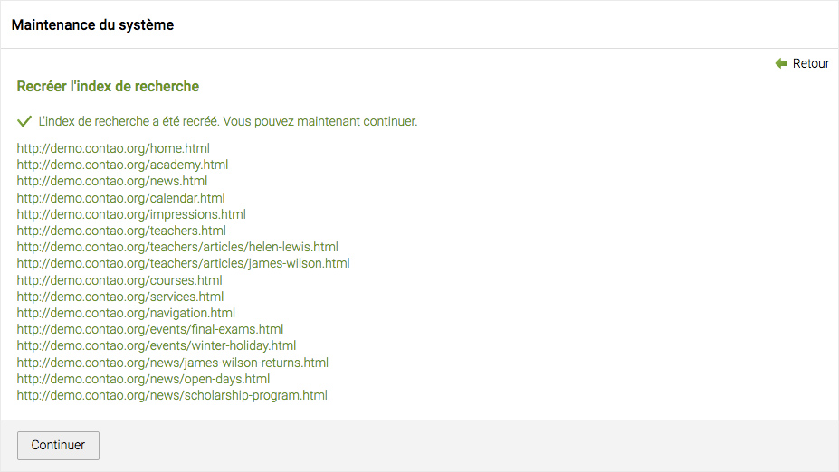

## Maintenance

La plupart des travaux d'entretien dans Contao sont exécutés automatiquement par
le "Periodic Command Scheduler", vous pouvez donc vous concentrer sur votre
travail. Même les tâches dans le module de maintenance sont effectuées
automatiquement, mais parfois il est nécessaire de les déclencher manuellement.

### Purger des données

Outre le contenu généré par l'utilisateur, Contao stocke beaucoup de données du
système qui sont utilisées pour restaurer les enregistrements supprimés, revenir
à des versions antérieures, créer l'index de recherche du site internet ou
réduire le temps de chargement d'une page. Vous pouvez purger ces données
manuellement par exemple pour supprimer les anciennes vignettes à partir du
cache d'images ou pour recréer les fichiers XML du plan du site après que vous
ayez modifié la structure de site.

### Reconstruire l'index de recherche

Les pages sont généralement ajoutées automatiquement à l'index de recherche
quand elles sont vues dans le front office (sauf si vous êtes connecté au back
office en même temps), vous n'avez donc pas besoin de vous inquiéter au sujet
de l'index de recherche. Cependant, si vous avez modifié un grand nombre de
pages, il est plus commode de les mettre à jour toutes à la fois au lieu de les
ouvrir une par une dans le navigateur. Dans ce cas, vous pouvez reconstruire
l'index de recherche manuellement.

