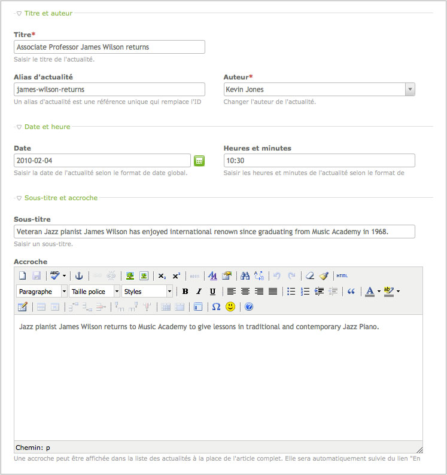

## Palettes

Une palette est un groupe de champs de formulaire qui sont nécessaires pour
modifier un enregistrement. Une palette ne contient typiquement pas toutes les
colonnes d'une table, mais seulement celles qui appartiennent à un certain
module ou un certain élément de contenu. Les palettes peuvent changer
dynamiquement suivant les droits de l'utilisateur ou le type de l'élément et
certains sous-ensembles du formulaire (appelés des subpalettes) peuvent être
chargés interactivement avec Ajax.


### Définir des groupes

Une palette est une chaîne de caractères composée de noms de champs concaténés
et séparés soit par des points-virgules (;), soit par des virgules (,). Alors
que la virgule est utilisée simplement pour séparer des noms de champs, le
point-virgule indique le commencement d'un nouveau fieldset, qui peut être
déroulé ou enroulé.



L'exemple ci-dessus se définit par le code suivant :

```php
{title_legend},headline,alias,author;{date_legend},date,time;{teaser_legend:hide},subheadline,teaser
```

Les éléments de substitution `title_legend` et `date_legend` seront remplacés
par leur libellé correspondant dans le tableau "TL_LANG".

```php
$GLOBALS['TL_LANG']['tl_news']['title_legend'] = 'Title and author';
$GLOBALS['TL_LANG']['tl_news']['date_legend']  = 'Date and time';
```


### Disposer les champs

Le back office de Contao utilise un système simple de grille en deux colonnes
pour disposer les champs d'entrées dans leurs groupes. Vous pouvez utiliser
les classes CSS suivantes dans la section évaluation du tableau conteneur de
données en tant que `tl_class` (exemple `'tl_class'=>'w50 wizard'`).

<table>
<tr>
  <th>tl_class</th>
  <th>Description</th>
</tr>
<tr>
  <td>w50</td>
  <td>Définit la largeur du champs à 50% et le rend flottant
  (<code>float:left</code>).</td>
</tr>
<tr>
  <td>clr</td>
  <td>Libère tous les éléments flottants (<code>clear:both</code>).</td>
</tr>
<tr>
  <td>wizard</td>
  <td>Raccourcit le champ de saisie de sorte qu'il y ait assez de place pour
  le bouton "Assistant" (par exemple les champs avec un sélecteur de dates).
  </td>
</tr>
<tr>
  <td>long</td>
  <td>Le champ de saisie de texte s'étend sur deux colonnes.</td>
</tr>
<tr>
  <td>m12</td>
  <td>Ajoute une marge supérieure de 12 pixels à l'élément (utilisé pour les
  cases à cocher uniques).</td>
</tr>
</table>
