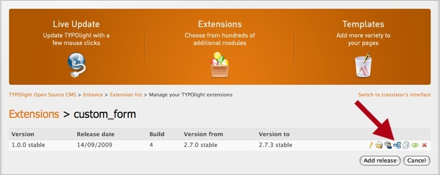

## Ajouter des dépendances

Peut-être que l'une de vos extensions utilise les fonctionalités d'une autre
extension comme par exemple les tâches planifiées (cron jobs). Pour faire
fonctionner votre extension, l'installation de l'extension cron constitue donc
un pré-requis, généralement appelé dépendance. Ces dépendances peuvent être
enregistrées dans le référentiel d'extensions, de telle sorte que les modules
nécessaires soient automatiquement installés lorsque vous installez une
extension particulière.

Choisissez d'abord l'extension que vous souhaitez ajouter en tant que dépendance
et confirmez votre choix en cliquant sur le bouton "Continue". Puis sélectionnez
la version minimale et maximale dont le fonctionnement avec votre extension est
reconnu.
