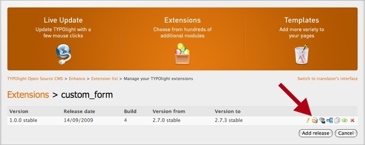

## Ajouter des fichiers

Vous devez ensuite ajouter des fichiers à la nouvelle release. Ouvrez le
gestionnaire de fichiers, et cliquez sur le bouton "Add/update files". Vous
pouvez téléverser des fichiers individuellement ou des archives .zip complètes.
Assurez-vous de choisir le bon répertoire cible, afin que les chemins d'accès
soient corrects à l'issue de l'envoi.

